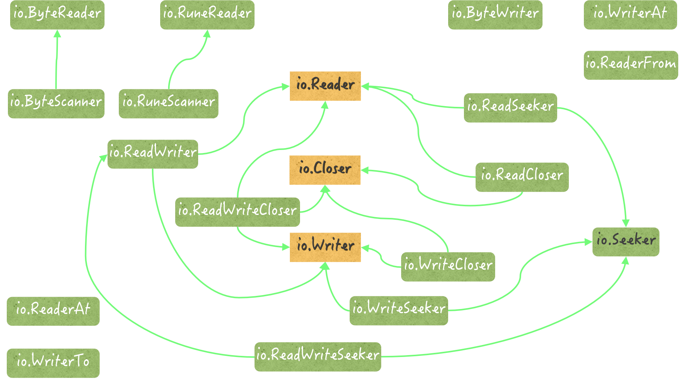

# 常见问题

##通道

### 概念
一个通道相当于一个先进先出（FIFO）的队列。也就是说，通道中的各个元素值都是严格地按照发送的顺序排列的，先被发送通道的元素值一定会先被接收。元素值的发送和接收都需要用到操作符<-。我们也可以叫它接送操作符。一个左尖括号紧接着一个减号形象地代表了元素值的传输方向。

### 对通道的发送和接收操作都有哪些基本的特性？
基本特性如下:
对于同一个通道，发送操作之间是互斥的，接收操作之间也是互斥的。(消息与消息之间互不影响，发送和接收只能存在一个，完成之后才能进行下一个）
发送操作和接收操作中对元素值的处理都是不可分割的。（发送或接收具有原子性，一气呵成的，绝不会被打断，不能成功一部分）
发送操作在完全完成之前会被阻塞。接收操作也是如此。

### 发送和接收
这里要注意的一个细节是，元素值从外界进入通道时会被复制。更具体地说，进入通道的并不是在接收操作符右边的那个元素值，而是它的副本。
另一方面，元素值从通道进入外界时会被移动。这个移动操作实际上包含了两步，第一步是生成正在通道中的这个元素值的副本，并准备给到接收方，第二步是删除在通道中的这个元素值。

### 发送操作和接收操作在什么时候可能被长时间的阻塞？
缓冲通道：
如果通道已满，那么对它的所有发送操作都会被阻塞。因为缓冲通道导致的阻塞，所在goruntine会进入等待队列
如果通道已空，那么对它的所有接收操作都会被阻塞，直到通道中有新的元素值出现。这时，通道会通知最早等待的那个接收操作所在的 goroutine
非缓冲通道：
无论是发送操作还是接收操作，一开始执行就会被阻塞，直到配对的操作也开始执行，才会继续传递。同步的。

值为nil的通道，不论它的具体类型是什么，对它的发送操作和接收操作都会永久地处于阻塞状态。它们所属的 goroutine 中的任何代码，都不再会被执行。

### 发送操作和接收操作在什么时候会引发 panic？
通道一旦关闭，再对它进行发送操作，就会引发 panic。
试图关闭一个已经关闭了的通道，也会引发 panic
如何感知关闭：当我们把接收表达式的结果同时赋给两个变量时，第二个变量的类型就是一定bool类型。它的值如果为false就说明通道已经关闭

### 单向通道有什么应用价值？
单向通道最主要的用途就是约束其他代码的行为。
场景：编写模板代码或者可扩展的程序库的时候。
单项通道也可以传双向通道，Go 语言在这种情况下会自动地把双向通道转换为函数所需的单向通道。
```
intChan1 := make(chan int, 3)
SendInt(intChan1)
```
### for ... range ...
```
intChan2 := getIntChan()
for elem := range intChan2 { 
	fmt.Printf("The element in intChan2: %v\n", elem)
}
```
* 上述for语句会不断地尝试从通道intChan2中取出元素值。即使intChan2被关闭了，也会在取出所有剩余的元素值之后再结束执行。
* 通常，当通道intChan2中没有元素值时，这条for语句会被阻塞在有for关键字的那一行，直到有新的元素值可取。不过，由于这里的getIntChan函数会事先将intChan2关闭，所以它在取出intChan2中的所有元素值之后会直接结束执行。
* 倘若通道intChan2的值为nil，那么这条for语句就会被永远地阻塞在有for关键字的那一行。

### select语句与通道怎样联用？
select语句只能与通道联用，它一般由若干个分支组成。每次执行这种语句的时候，一般只有一个分支中的代码会被运行.专门为通道设计到的，所以只能包含通道的表达式
select语句的分支分为两种，一种叫做候选分支，另一种叫做默认分支。
候选分支总是以关键字case开头，后跟一个case表达式和一个冒号，然后我们可以从下一行开始写入当分支被选中时需要执行的语句。
默认分支其实就是 default case，因为，当且仅当没有候选分支被选中时它才会被执行，所以它以关键字default开头并直接后跟一个冒号


### select关键字用法
每个 case都是对应一个channel的I/O操作
所有被发送的表达式都会被求值
多用于超时控制

### 应该注意些什么？
1.加入了默认分支，那么无论涉及通道操作的表达式是否有阻塞，select语句都不会被阻塞.
2.如果没有加入默认分支,且所有的case表达式都没有满足求值条件，那么select语句就会被阻塞。
3.应当接收第二个参数，判断通道是否关闭，进行必要措施。
4.select语句只能对其中的每一个case表达式各求值一次。所以，如果我们想连续或定时地操作其中的通道的话，就往往需要通过在for语句中嵌入select语句的方式实现。

### select语句的分支选择规则都有哪些？
1.表达式总会以从左到右的顺序被求值执行 case从上倒下执行
2.作正处于阻塞状态，那么对该case表达式的求值就是不成功的，是不满足条件的。
3.所有case表达式都被求值完毕后，它才会开始选择候选分支，多个满足随机一个
4.只有一个默认分支，与位置无关

### 在select语句与for语句联用时，怎样直接退出外层的for语句？
根据情况使用goto或者return

### 如果在select语句中发现某个通道已关闭，那么应该怎样屏蔽掉它所在的分支？
如果判断到chan关闭，即取到的第二个值为false。则将该chan赋值为nil。

### 协程 线程 进程
进程
进程是系统资源分配的最小单位。独立，开销大。每个进程都有自己的独立内存空间，不同进程通过进程间通信来通信。
线程
线程是CPU调度的最小单位。不一定独立，开销小。线程是进程的一个实体,是CPU调度和分派的基本单位,它是比进程更小的能独立运行的基本单位
协程
协程是一种用户态的轻量级线程，协程的调度完全由用户控制。协程拥有自己的寄存器上下文和栈。协程调度切换时，将寄存器上下文和栈保存到其他地方，在切回来的时候，恢复先前保存的寄存器上下文和栈，直接操作栈则基本没有内核切换的开销，可以不加锁的访问全局变量，所以上下文的切换非常快。

https://cloud.tencent.com/developer/article/1376478
https://blog.csdn.net/fadbgfnbxb/article/details/88787361
https://blog.csdn.net/chen1415886044/article/details/104613097

线程和进程
地址空间:线程是进程内的一个执行单元，进程内至少有一个线程，它们共享进程的地址空间，而进程有自己独立的地址空间
资源拥有:进程是资源分配和拥有的单位,同一个进程内的线程共享进程的资源
每个独立的线程有一个程序运行的入口、顺序执行序列和程序的出口，但是线程不能够独立执行，必须依存在应用程序中，

协程与线程
线程进程都是同步机制，而协程则是异
线程是抢占式，而协程是非抢占式的，所以需要用户自己释放使用权来切换到其他协程，因此同一时间其实只有一个协程拥有运行权，相当于单线程的能力

默认栈的大小：
线程是 1M goruntine 是25k
内核的对应关系 线程 1:1  协程是 m:n


### 并发和并行
并发：
同时运行多个程序或多个任务需要被处理的现象，CPU核心数无关，是操作系统进程调度和CPU上下文切换达到的结果
发偏重于多个任务交替执行，而多个任务之间有可能还是串行的，我的理解并发是为了更好的利用每一个核，并行是每个核都被利用。
并行：
可以同时通过多进程/多线程的方式取得多个任务，并以多进程或多线程的方式同时执行这些任务，硬件角度上则依赖于多核CPU。

### 内核 - p 协程处理器 - goruntine之间的关系

## 并发问题
### 只执行一次 ---单例
``` go
var once sync.Once
var singleInstance *Singleton

func GetSingletonObj() *Singleton {
	once.Do(func() {
		fmt.Println("Create Obj")
		singleInstance = new(Singleton)
	})
	return singleInstance
}
```

## 我们可以让命令源码文件接受哪些类型的参数值？
命令源码文件支持的参数:
int(int|int64|uint|uint64),
float(float|float64)
string,
bool,
duration(时间),
var(自定义)
关键就是使用flag.var()，关键点在于需要实现flag包的Value接口。
https://studygolang.com/articles/3365?t=1493776691081

## 格式化输出
%d 十进制整数
%b 一个二进制整数，将一个整数格式转化为二进制的表达方式
%c 一个Unicode的字符
%x/%X  小/大写的十六进制数值
%s 输出以原生的UTF8字节表示的字符，如果console不支持utf8编码，则会乱码
%t 以true或者false的方式输出布尔值
%T 输出值的类型
%v 使用默认格式输出值，或者如果方法存在，则使用类性值的String()方法输出自定义值
%U Unicode格式：U+1234，等同于 “U+%04X”
%q 单引号围绕的字符字面值，由Go语法安全地转义

## 命令源码文件的用途是什么，怎样编写它？
命令源码文件是程序的运行入口，是每个可独立运行的程序必须拥有的。我们可以通过构建或安装，生成与其对应的可执行文件，后者一般会与该命令源码文件的直接父目录同名。
如果一个源码文件声明属于main包，并且包含一个无参数声明且无结果声明的main函数，那么它就是命令源码文件。


### 那么什么是库源码文件呢？
库源码文件是不能被直接运行的源码文件，它仅用于存放程序实体，这些程序实体可以被其他代码使用.

## 代码包声明的基本规则
第一条规则，同目录下的源码文件的代码包声明语句要一致。也就是说，它们要同属于一个代码包。这对于所有源码文件都是适用的。
第二条规则，源码文件声明的代码包的名称可以与其所在的目录的名称不同。在针对代码包进行构建时，生成的结果文件的主名称与其父目录的名称一致。

## 访问权限
1.大小写
2.internal包 代码包中声明的公开程序实体仅能被该代码包的直接父包及其子包中的代码引用

##包冲突
如果你需要导入两个代码包，而这两个代码包的导入路径的最后一级是相同的，比如：dep/lib/flag和flag
a.如果文件夹下文件声明的包名相同，则肯定冲突，会报错redeclared。
b.如果文件夹下文件声明的包名不同，也不会冲突。

如果会产生冲突，那么怎样解决这种冲突，有几种方式？
匿名、别名

## 声明变量有几种方式
var name string
var name = "aaa";
name := "aaa";
var name = flag.String("name", "everyone", "The greeting object.") //指针
name := flag.String("name", "everyone", "The greeting object.")
一个是你要知道 Go 语言中的类型推断，以及它在代码中的基本体现，另一个是短变量声明的用法。

## 语言的类型推断可以带来哪些好处？
Go 语言的类型推断可以明显提升程序的灵活性，使得代码重构变得更加容易，同时又不会给代码的维护带来额外负担（实际上，它恰恰可以避免散弹式的代码修改），更不会损失程序的运行效率。
类型推断：类型推断只应用在了对变量或常量的初始化方面

## 变量重声明的条件
* 被“声明并赋值”的变量必须是多个，并且其中至少有一个是新的变量。这时我们才可以说对其中的旧变量进行了重声明。
* 变量的重声明只有在使用短变量声明时才会发生，否则也无法通过编译。
* 由于变量的类型在其初始化时就已经确定了，所以对它再次声明时赋予的类型必须与其原本的类型相同，否则会产生编译错误。

## 重名变量vs 变量重声明
* 变量重声明中的变量一定是在某一个代码块内的。
* 变量重声明是对同一个变量的多次声明，这里的变量只有一个。而可重名变量中涉及的变量肯定是有多个的。
* 不论对变量重声明多少次，其类型必须始终一致，具体遵从它第一次被声明时给定的类型。而可重名变量之间不存在类似的限制，它们的类型可以是任意的
* 如果可重名变量所在的代码块之间，存在直接或间接的嵌套关系，那么它们之间一定会存在“屏蔽”的现象


## 如果通过import . XXX这种导入代码包中的变量与当前代码包中的变量重名了，那么 Go 语言是会把它们当做“可重名变量”看待还是会报错呢？
如果都是全局的变量，会报重复声明，如果只是在函数体重新声明，作用域不一样。

## 如何判断数据类型
1.类型断言 ：value, ok :=x.(T)  x必须是接口类型  eg:value, ok := interface{}(container).([]string)
2.x.(type)  只能在switch中使用
```
  switch t := containerI.(type) {
	case []string:
		elem = t[1]
	case map[int]string:
		elem = t[1]
	default:
		err = fmt.Errorf("unsupported container type: %T", containerI)
		return
	}
```

## 类型转换
当整数值的类型的有效范围由宽变窄时，只需在补码形式下截掉一定数量的高位二进制数即可。
虽然直接把一个整数值转换为一个string类型的值是可行的，但值得关注的是，被转换的整数值应该可以代表一个有效的 Unicode 代码点
string(-1)---乱码
知识点是关于string类型与各种切片类型之间的互转的。

string([]byte{'\xe4', '\xbd', '\xa0', '\xe5', '\xa5', '\xbd'}) // 你好
string([]rune{'\u4F60', '\u597D'}) // 你好

## 别名类型
别名类型与其源类型的区别恐怕只是在名称上，它们是完全相同的。
type MyString = string
byte是uint8的别名类型，
rune是int32的别名类型。

## 类型再定义
type MyString2 string
两个不同的类型了

## 潜在类型
潜在类型的含义是，某个类型在本质上是哪个类型。
潜在类型相同的不同类型的值之间是可以进行类型转换的，但不能进行判等或比较，它们的变量之间也不能赋值。
比如类型再定义 中的MyString2 和 string

## 引用类型
字典类型、通道类型、函数类型、切片类型,接口


## 值类型
数组类型、结构体类型、基础数据类型（int系列、float系列、bool、string）

## 怎样估算切片容量的增长？
< 1024 新切片的容量将会是原切片容量的 2 倍
> 1024 原容量的1.25倍作为新容量的基准

## 为什么字典的键类型会受到约束？
映射过程---把键值转换为哈希值，通过哈希桶均匀地储存其所属哈希表收纳的键 - 元素对，查找时首先判断哈希值，然后判断键
字典不会独立存储任何键的值，但会独立存储它们的哈希值。因为存在哈希碰撞，所以键需要满足==和!=操作

## 字典的键类型不能是哪些类型
函数类型、字典类型、切片类型的值
支持
基本类型、指针类型，以及数组类型、结构体类型和接口类型

## 应该优先考虑哪些类型作为字典的键类型
优先选用数值类型和指针类型，通常情况下类型的宽度越小越好。如果非要选择字符串类型的话，最好对键值的长度进行额外的约束。

## 在值为nil的字典上执行读操作会成功吗，那写操作呢？
notice 初始化
除了除了添加键 - 元素对 其他操作都可以
添加键 - 元素对 --panic

## 函数
### 函数是一等公民
简单来说，这意味着函数不但可以用于封装代码、分割功能、解耦逻辑，还可以化身为普通的值，在其他函数间传递、赋予变量、做类型判断和转换等等，就像切片和字典的值那样。

### 函数的签名
函数的签名其实就是函数的参数列表和结果列表的统称，它定义了可用来鉴别不同函数的那些特征，同时也定义了我们与函数交互的方式
注意，各个参数和结果的名称不能算作函数签名的一部分，甚至对于结果声明来说，没有名称都可以。

### 怎样编写高阶函数
1. 接受其他的函数作为参数传入；
2. 把其他的函数作为结果返回

### 函数传值
更改的拷贝
```
complexArray1 := [3][]string{
  []string{"d", "e", "f"},
  []string{"g", "h", "i"},
  []string{"j", "k", "l"},
}
这样一个值被传入函数的话，函数中对该参数值的修改会影响到complexArray1本身吗？
分2种情况，若是修改数组中的切片的某个元素，会影响原数组。若是修改数组的某个元素即a[1]=[]string{"x"}就不会影响原数组。谨记Go中都是浅拷贝，值类型和引用类型的区别
```

## 结构体

###  方法和函数
方法却不同，它需要有名字，不能被当作值来看待，最重要的是，它必须隶属于某一个类型。
方法隶属的类型其实并不局限于结构体类型，但必须是某个自定义的数据类型，并且不能是任何接口类型。

### String()
不用显式调用，格式化结构输出.fmt.Printf函数会自己去寻找它。(应该是需要字符输出的地方)
％v格式化时

```
type Animal struct {
  scientificName string // 学名。
  AnimalCategory    // 动物基本分类。
}
```
### Animal类型中的字段声明AnimalCategory代表了什么？
字段声明AnimalCategory代表了Animal类型的一个嵌入字段。Go 语言规范规定，如果一个字段的声明中只有字段的类型名而没有字段的名称，那么它就是一个嵌入字段，也可以被称为匿名字段。我们可以通过此类型变量的名称后跟“.”，再后跟嵌入字段类型的方式引用到该字段。也就是说，嵌入字段的类型既是类型也是名

### 结构体屏蔽
假如存在相同的方法、字段，被嵌入的会被屏蔽。
如果不存在，嵌入的才会采用

### 值方法和指针方法都是什么意思，有什么区别？
把取值操作符*放在这样一个指针值的左边来组成一个取值表达式，以获取该指针值指向的基本类型值，
也可以通过把取址操作符&放在一个可寻址的基本类型值的左边来组成一个取址表达式，以获取该基本类型值的指针值。

1.值方法的接收者是该方法所属的那个类型值的一个副本。我们在该方法内对该副本的修改一般都不会体现在原值上，除非这个类型本身是某个引用类型（比如切片或字典）的别名类型
而指针方法的接收者，是该方法所属的那个基本类型值的指针值的一个副本。我们在这样的方法内对该副本指向的值进行修改，却一定会体现在原值上
2.一个自定义数据类型的方法集合中仅会包含它的所有值方法，而该类型的指针类型的方法集合却囊括了前者的所有方法，包括所有值方法和所有指针方法
基本类型的值上只能调用到它的值方法。但是，Go 语言会适时地为我们进行自动地转译，使得我们在这样的值上也能调用到它的指针方法。


### Go 语言是用嵌入字段实现了继承吗？
no.

### 字面量struct{}代表了什么？又有什么用处？
 空结构体不占用内存空间，但是具有结构体的一切属性，如可以拥有方法，可以写入channel。所以当我们需要使用结构体而又不需要具体属性时可以使用它。 struct{}{}


## 接口
当我们在谈论“接口”的时候，一定指的是接口类型。因为接口类型与其他数据类型不同，它是没法被实例化的
对于某一个接口类型来说，如果没有任何数据类型可以作为它的实现，那么该接口的值就不可能存在。
接口类型声明中的这些方法所代表的就是该接口的方法集合。一个接口的方法集合就是它的全部特征。

### 接口和结构体
接口--方法方法定义  结构体类型包裹的是它的字段声明

### 接口的实现方式
duck type


### 怎样判定一个数据类型的某一个方法实现的就是某个接口类型中的某个方法呢？
两个充分必要条件，一个是“两个方法的签名需要完全一致”，
另一个是“两个方法的名称要一模一样”。

### 接口-静态类型、动态类型
一个接口自己就是自己的静态类型，是固定不变的
但是实现了接口的类型可以很多，可以赋值给接口变量，可以理解为动态类

### 赋值通用的规则
如果我们使用一个变量给另外一个变量赋值，那么真正赋给后者的，并不是前者持有的那个值，而是该值的一个副本。

### 接口类型值的存储方式
接口有一个专用的数据结构 存储信息
包含两个指针
一个是指向类型信息的指针---动态值类型，方法、调用路径
另一个是指向动态值的指针另一个是指向动态值的指针
notice:只声明而不初始化，或者显式地赋给它nil 接口才可能为nil

### 接口的组合
推荐小接口彼此组合
```
type Animal interface {
  ScientificName() string
  Category() string
}

type Pet interface {
  Animal
  Name() string
}
```
### 关于思考题，如果我们把一个值为nil的某个实现类型的变量赋给了接口变量，那么在这个接口变量上仍然可以调用该接口的方法吗？
可以的，不过方法内不能使用实现类型内的变量，并且方法接收者必须是指针类型。

## 指针的有限操作
> uintptr
uintptr是一个整数类型
uintptr类型只有在底层编程是才需要，特别是Go语言和C语言函数库或操作系统接口相交互的地方。
> unsafe.Pointer可以表示任何指向可寻址的值的指针，同时它也是前面提到的指针值和uintptr值之间的桥梁。
unsafe.Pointer是一个指针类型

### 你能列举出 Go 语言中的哪些值是不可寻址的吗？
1.不可变的值不可寻址。常量、基本类型的值字面量、字符串变量的值、函数以及方法的字面量都是如此。其实这样规定也有安全性方面的考虑。
2.绝大多数被视为临时结果的值都是不可寻址的。算术操作的结果值属于临时结果，针对值字面量的表达式结果值也属于临时结果。但有一个例外，对切片字面量的索引结果值虽然也属于临时结果，但却是可寻址的。
3.若拿到某值的指针可能会破坏程序的一致性，那么就是不安全的，该值就不可寻址(函数、方法)

### 指针值和uintptr类型值之间的转换
对于指针值和uintptr类型值之间的转换，必须使用unsafe.Pointer类型的值作为中转

## go语言执行规则

### Go 并发编程模型
用户级线程 goroutine 
对接系统级线程的调度器 processor
系统级线程 machine M

### 用什么手段可以对 goroutine 的启用数量加以限制？
### runtime包中提供了哪些与模型三要素 G、P 和 M 相关的函数？
runtime.GOMAXPROCS
runtime.NumCPU
runtime.NumGoroutine

## for range
### 接收
当只有一个接收值 ，那个变量是索引
numbers1 := []int{1, 2, 3, 4, 5, 6}
for i := range numbers1 

### 数组
```
for i, e := range numbers2 
```
range表达式的求值结果会被复制，也就是说，被迭代的对象是range表达式结果值的副本而不是原值

### 切片
```
for i, e := range numbers2 
```
是指针副本，更改会影响原值

### swich case
规则：
1.switch 需要和case的类型一致
2.且只有一个满足
3.当case是值是无类型的常量，它的类型会被自动地转换为switch表达式的结果类型
4.switch t := value6.(type)  类型判断
5.只有在case中明确添加fallthrough关键字，才会继续执行紧跟的下一个case

写法：单个case中，可以出现多个结果选项，以逗号分隔

## 错误处理

### error
error类型其实是一个接口类型，也是一个 Go 语言的内建类型。在这个接口类型的声明中只包含了一个方法Error
```go
package errors

func New(text string) error {
	return &errorString{text}
}
type errorString struct {
	s string
}
func (e *errorString) Error() string {
	return e.s
}
```
### panic
在大多数操作系统中，只要退出状态码不是0，都意味着程序运行的非正常结束。在 Go 语言中，因 panic 导致程序结束运行的退出状态码一般都会是2。

### 从 panic 被引发到程序终止运行的大致过程是什么？
我们先说一个大致的过程：某个函数中的某行代码有意或无意地引发了一个 panic。这时，初始的 panic 详情会被建立起来，并且该程序的控制权会立即从此行代码转移至调用其所属函数的那行代码上，也就是调用栈中的上一级。
这也意味着，此行代码所属函数的执行随即终止。紧接着，控制权并不会在此有片刻的停留，它又会立即转移至再上一级的调用代码处。控制权如此一级一级地沿着调用栈的反方向传播至顶端，也就是我们编写的最外层函数那里。
这里的最外层函数指的是go函数，对于主 goroutine 来说就是main函数。但是控制权也不会停留在那里，而是被 Go 语言运行时系统收回。
随后，程序崩溃并终止运行，承载程序这次运行的进程也会随之死亡并消失。与此同时，在这个控制权传播的过程中，panic 详情会被逐渐地积累和完善，并会在程序终止之前被打印出来。

### panic和错误
错误是可控的
panic致命的

### 一个函数怎样才能把 panic 转化为error类型值，并将其作为函数的结果值返回给调用方？
一个函数如果要把 panic 转化为error类型值，并将其结果返回给调用方，可以考虑把 defer 语句封装到一个匿名函数之中，下面是实验的一个例子，所用函数是一个除法函数，当除数为0的时候会抛出 panic并捕获。

### 怎样让 panic 包含一个值，以及应该让它包含什么样的值？
至少在程序崩溃的时候，panic 包含的那个值字符串表示形式会被打印出来。最好支持Error和String方法

### 怎样施加应对 panic 的保护措施，从而避免程序崩溃？
defer语句和recover函数调用，才能够恢复一个已经发生的 panic。

### 如果一个函数中有多条defer语句，那么那几个defer函数调用的执行顺序是怎样的？
在同一个函数中，defer函数调用的执行顺序与它们分别所属的defer语句的出现顺序（更严谨地说，是执行顺序）完全相反。
相当于一个栈，后进先出。

### 我们可以在defer函数中恢复 panic，那么可以在其中引发 panic 吗？
如果defer中引发panic，那么在该段defer函数之前，需要另外一个defer来捕获该panic，并且代码中最后一个panic会被抛弃，由defer中的panic来成为最后的异常返回。

## 测试
###Go 语言对测试函数的名称和签名都有哪些规定？
测试源码文件的主名称应该以被测源码文件的主名称为前导，并且必须以“_test”为后缀。
对于功能测试函数来说，其名称必须以Test为前缀，并且参数列表中只应有一个*testing.T类型的参数声明。
对于性能测试函数来说，其名称必须以Benchmark为前缀，并且唯一参数的类型必须是*testing.B类型的。
对于示例测试函数来说，其名称必须以Example为前缀，但对函数的参数列表没有强制规定。

### go test命令执行的主要测试流程是什么？
go test命令在开始运行时，会先做一些准备工作，比如，判断我们给予的标记是否合法,检查我们指定的代码包或源码文件的有效性，以及，等等。
在准备工作顺利完成之后，go test命令就会针对每个被测代码包，依次地进行构建、执行包中符合要求的测试函数，清理临时文件，打印测试结果。这就是通常情况下的主要测试流程。
性能测试函数的执行也都会是串行的。

### * t.testing的一些方法
t.Fail()  和t.FaiFailNowl()  ---无参数   ---失败---立即失败
t.Fatal  和 t.FatalF  ---有参数   ----测试失败的同时打印失败测试日志
t.Error 和 t.ErrorF   ---有参数   ----测试失败的同时打印失败测试日志
t.Log 和 t.Logf       ---有参数   ---有无格式 -----只有错误的时候打印

### 性能测试 
* b.testing
* -bench=.
* -run=^$ 执行哪些函数
* -benchmem 输出基准测试的内存分配统计信息。
* -benchtime 用于指定基准测试的探索式测试执行时间上限

```
BenchmarkGetPrimes-8 500000 2314 ns/op
一台计算机的 CPU 核心的个数   执行的实际次数  单次执行时间
```

### 性能测试函数中的计时器是做什么用的？
b.StartTimer()
b.StopTimer()
b.ResetTimer() 重置-去除在调用它之前那些代码的执行时间

### parallel
作用是：设置同一个被测代码包中的功能测试函数的最大并发执行数。该标记的默认值是测试运行时的最大 P 数量。

### -cpu
逻辑 CPU 切片
-cpu=2,4
-count 专门用于重复执行测试函数的。它的值必须大于或等于0，并且默认值为1
性能测试函数的执行次数 = `-cpu`标记的值中正整数的个数 x `-count`标记的值 x 探索式执行中测试函数的实际执行次数
专门用于重复执行测试函数的。它的值必须大于或等于0，并且默认值为1

## Mutex
1.一旦数据被多个线程共享，那么就很可能会产生争用和冲突的情况。这种情况也被称为竞态条件
2.同步的用途有两个，一个是避免多个线程在同一时刻操作同一个数据块，另一个是协调多个线程，以避免它们在同一时刻执行同一个代码块。
3.施加保护的重要手段之一，就是使用实现了某种同步机制的工具，也称为同步工具。
4.在 Go 语言中，可供我们选择的同步工具并不少。其中，最重要且最常用的同步工具当属互斥量（mutual exclusion，简称 mutex。

只要一个代码片段需要实现对共享资源的串行化访问，就可以被视为一个临界区
一个互斥锁可以被用来保护一个临界区或者一组相关临界区。我们可以通过它来保证，在同一时刻只有一个 goroutine 处于该临界区之内。

### 我们使用互斥锁时有哪些注意事项？
不要重复锁定互斥锁；
不要忘记解锁互斥锁，必要时使用defer语句；
不要对尚未锁定或者已解锁的互斥锁解锁；
不要在多个函数之间直接传递互斥锁。

### 推荐使用方式
每一个互斥锁都只保护一个临界区或一组相关临界区。

### 死锁
所谓的死锁，指的就是当前程序中的主 goroutine，以及我们启用的那些 goroutine 都已经被阻塞


### 互斥锁的重复锁定和重复解


### s来说有如下规则
在写锁已被锁定的情况下再试图锁定写锁，会阻塞当前的 goroutine。
在写锁已被锁定的情况下试图锁定读锁，也会阻塞当前的 goroutine
在读锁已被锁定的情况下试图锁定写锁，同样会阻塞当前的 goroutine。
在读锁已被锁定的情况下再试图锁定读锁，并不会阻塞当前的 goroutine。

## sync.cond

### 条件变量
条件变量并不是被用来保护临界区和共享资源的，它是用于协调想要访问共享资源的那些线程的。当共享资源的状态发生变化时，它可以被用来通知被互斥锁阻塞的线程。

### 条件变量怎样与互斥锁配合使用？
条件变量的初始化离不开互斥锁，并且它的方法有的也是基于互斥锁的。
条件变量提供的方法有三个：等待通知（wait）、单发通知（signal）和广播通知（broadcast）。

## atomic
因为原子操作不能被中断，所以它需要足够简单，并且要求快速。

### sync/atomic包中提供了几种原子操作？可操作的数据类型又有哪些？
sync/atomic包中的函数可以做的原子操作有：加法（add）、比较并交换（compare and swap，简称 CAS）、加载（load）、存储（store）和交换（swap）

sync/atomic支持的的数据类型并不多。但对这些类型中的每一个，sync/atomic包都会有一套函数给予支持。
这些数据类型有：int32、int64、uint32、uint64、uintptr，以及unsafe包中的Pointer。

### 传入这些原子操作函数的第一个参数值对应的都应该是那个被操作的值。比如，atomic.AddInt32函数的第一个参数，对应的一定是那个要被增大的整数。可是，这个参数的类型为什么不是int32而是*int32呢？
为原子操作函数需要的是被操作值的指针，而不是这个值本身；被传入函数的参数值都会被复制，像这种基本类型的值一旦被传入函数，就已经与函数外的那个值毫无关系了。所以，传入值本身没有任何意义。所以需要的仍然是指向这个指针值的指针。

### atomic.AddInt32函数可以用于减小那个被操作的整数值吗？
tomic.AddInt32函数的第二个参数代表差量，它的类型是int32，是有符号的。如果我们想做原子减法，那么把这个差量设置为负整数就可以了

### 比较并交换操作与交换操作相比有什么不同？优势在哪里？
比较并交换操作即 （比较并交换）CAS 操作，是有条件的交换操作，只有在条件满足的情况下才会进行值的交换。
atomic.CompareAndSwapInt32(&num2, 10, 0) 地址 + 旧值 + 新值
所谓的交换指的是，把新值赋给变量，并返回变量的旧值。

### 假设我已经保证了对一个变量的写操作都是原子操作，比如：加或减、存储、交换等等，那我对它进行读操作的时候，还有必要使用原子操作吗？
如果写操作还没有进行完，读操作就来读了，那么就只能读到仅修改了一部分的值。这显然破坏了值的完整性，读出来的值也是完全错误的。

### 互斥锁和原子
只涉及并发地读写单一的整数类型值，或者多个互不相关的整数类型值，那就不要再考虑互斥锁了。这主要是因为原子操作函数的执行速度要比互斥锁快得多。

### atomic.Value原子值来存储值，有两条强制性的使用规则
第一条规则，不能用原子值存储nil。
二条规则，我们向原子值存储的第一个值，决定了它今后能且只能存储哪一个类型的值。
（你可能会想：我先存储一个接口类型的值，然后再存储这个接口的某个实现类型的值，这样是不是可以呢？ ---不可以）

### 方法
两个指针方法：Store和Load
存储的原子性

### 原子值使用建议
1. 不要把内部使用的原子值暴露给外界
2. 如果不得不让包外，或模块外的代码使用你的原子值，那么可以声明一个包级私有的原子变量，然后再通过一个或多个公开的函数，让外界间接地使用到它。
3. 如果通过某个函数可以向内部的原子值存储值的话，那么就应该在这个函数中先判断被存储值类型的合法性。
4. 如果可能的话，我们可以把原子值封装到一个数据类型中，比如一个结构体类型。
5. 尽量不要向原子值中存储引用类型的值。因为这很容易造成安全漏洞


### 如果要对原子值和互斥锁进行二选一，你认为最重要的三个决策条件应该是什么？
1. 是否一定要操作引用类型的值；
2. 是否一定要操作nil；
3. 是否需要处理一个接口的不同类型。
4. 其实主要还是变量类型，原子操作在这块是严格的。能用原子就用原子。锁这个原语还是相对较重。

### Locker
```go
type Locker interface {
	Lock()
	Unlock()
}
```

## sync/WaitGroup
sync.WaitGroup类型 是开箱即用的，也是并发安全的
拥有三个指针方法：Add、Done和Wait
推荐defer中调用Done
 A WaitGroup must not be copied after first use. （比如不要当作参数传递）


### sync.WaitGroup类型值中计数器的值可以小于0吗？
不可以。panic
注意：WaitGroup值是可以被复用的，但需要保证其计数周期的完整性。计数器的值始于0又归为0，就可以被视为一个计数周期。

## sync.Once

### sync.Once类型值的Do方法是怎么保证只执行参数函数一次的？
sync.Once类型（以下简称Once类型）也属于结构体类型，同样也是开箱即用和并发安全的。由于这个类型中包含了一个sync.Mutex类型的字段，所以，复制该类型的值也会导致功能的失效
```go
once.Do(func() {
		atomic.AddUint32(&counter, 1)
	})
```

### sync.Once的设计
```
type Once struct {
	m    Mutex
	done uint32
}
```
done记录次数
m 原子锁

## context
```go
type Context interface {
	//Deadline方法是获取设置的截止时间的意思，第一个返回式是截止时间，到了这个时间点，Context会自动发起取消请求；第二个返回值ok==false时表示没有设置截止时间，
	Deadline() (deadline time.Time, ok bool)
    //Done方法返回一个只读的chan，类型为struct{}，我们在goroutine中，如果该方法返回的chan可以读取，则意味着parent context已经发起了取消请求，我们通过Done方法收到这个信号后，就应该做清理操作，然后退出goroutine，释放资源。
	Done() <-chan struct{}
    // Err方法返回取消的错误原因，因为什么Context被取消。
	Err() error   //context.Canceled  DeadlineExceeded 两种可能
    //
	Value(key interface{}) interface{}
}
type emptyCtx int //实现了接口
var (
	background = new(emptyCtx)
	todo       = new(emptyCtx)
)
```

### Context的继承衍生
根 可以通过下面获取预定义好的
context.Background
context.todo 
它不提供任何额外的功能。也就是说，它既不可以被撤销（cancel），也不能携带任何数据。

子 四个繁衍Context值的函数
WithCancel、WithDeadline、WithTimeout和WithValue
WithValue函数，我们可以通过调用它，产生一个会携带额外数据的parent的子值，函数得到的Context值是不可撤销的


### context.WithValue
父值、键和值
node6 := context.WithValue(node5, keys[3], values[3])
fmt.Printf("key %v foun: %v\n", keys[1], node6.Value(keys[1]))

### context的理解
https://www.cnblogs.com/zhangboyu/p/7456606.html
https://www.jianshu.com/p/6c8c5246058d

context包通过构建树型关系的Context，来达到上一层Goroutine能对传递给下一层Goroutine的控制。对于处理一个Request请求操作，需要采用context来层层控制Goroutine，以及传递一些变量来共享。

每次创建一个Goroutine，要么将原有的Context传递给Goroutine，要么创建一个子Context并传递给Goroutine。

当通过父Context对象创建子Context对象时，可同时获得子Context的一个撤销函数，这样父Context对象的创建环境就获得了对子Context将要被传递到的Goroutine的撤销权。

上层Goroutine更好的管理子任务而生。

## sync.Map

### 键的要求
有要求。键的实际类型不能是函数类型、字典类型和切片类型

### 怎样保证并发安全字典中的键和值的类型正确性？
1.让并发安全字典只能存储某个特定类型的键
两者对应的方法名称完全一致，方法签名也非常相似，只不过，与键和值相关的那些参数和结果的类型不同而已。在IntStrMap类型的方法签名中，明确了键的类型为int，且值的类型为string

2.我们封装的结构体类型的所有方法，都可以与sync.Map类型的方法完全一致（包括方法名称和方法签名）
```go
type ConcurrentMap struct {
 m         sync.Map
 keyType   reflect.Type
 valueType reflect.Type
}
```

### sync.Map方法
Load -读取  func (cMap *ConcurrentMap) Load(key interface{}) (value interface{}, ok bool)
Store -储存   func (cMap *ConcurrentMap) Store(key, value interface{}) 

### 并发安全字典如何做到尽量避免使用锁？
sync.Map类型在内部使用了大量的原子操作来存取键和值，并使用了两个原生的map作为存储介质。
其中一个原生map被存在了sync.Map的read字段中，该字段是sync/atomic.Value类型的。
sync.Map中的另一个原生字典由它的dirty字段代表
注意，脏字典和只读字典如果都存有同一个键值对，那么这里的两个键指的肯定是同一个基本值，对于两个值来说也是如此

read可能是不全的
两个map会切换

### sync.Map场景
读多写少

## sync.Pool
临时对象池，它的值可以被用来存储临时的对象.结构体类型，它的值在被真正使用之后，就不应该再被复制了
sync.Pool类型只有两个方法——Put和Get
Put 在当前的池中存放临时对象
Get Get 则被用于从当前的池中获取临时对象，它会返回一个interface{}类型的值 

### sync.Pool临时对象池
```go
type Pool struct {
	noCopy noCopy

	local     unsafe.Pointer // local fixed-size per-P pool, actual type is [P]poolLocal
	localSize uintptr        // size of the local array

	// It may not be changed concurrently with calls to Get.
	New func() interface{}  //初始化时需要
}
bufPool = sync.Pool{
		New: func() interface{} {
			return &myBuffer{delimiter: delimiter}
		},
}
```

### 为什么说临时对象池中的值会被及时地清理掉？
因为，Go 语言运行时系统中的垃圾回收器，所以在每次开始执行之前，都会对所有已创建的临时对象池中的值进行全面地清除。

### sync.pool结构
本地池列表 ---数量与p相同
本地池 ---一个私有的临时对象  ----一个共享的临时对象列表

### 临时对象池是怎样利用内部数据结构来存取值的？
只有当这个private字段的值为nil时，它才会去访问本地池的shared字段。
一个私有的临时对象 ---安全的
共享的临时对象列表 --需要锁

### 它会在什么时候被销毁
sync包在被初始化的时候，会向 Go 语言运行时系统注册一个函数，池清理函数。
另外，在sync包中还有一个包级私有的全局变量。这个变量代表了当前的程序中使用的所有临时对象池的汇总，它是元素类型为*sync.Pool的切片。我们可以称之为池汇总列表。
池清理函数会遍历池汇总列表。对于其中的每一个临时对象池，它都会先将池中所有的私有临时对象和共享临时对象列表都置为nil，然后再把这个池中的所有本地池列表都销毁掉。

### 怎样保证一个临时对象池中总有比较充足的临时对象？
临时对象池初始化时指定new字段对应的函数返回一个新建临时对象；
临时对象使用完毕时调用临时对象池的put方法，把该临时对象put回临时对象池中。
这样就能保证一个临时对象池中总有比较充足的临时对象。

## unicode与字符编码
go需要按照 Unicode 编码规范中的 UTF-8 编码格式进行编码

### ASCII 编码
128个字符

### UnicodeUnicode 
Unicode 编码规范是另一个更加通用的字符编码标准，它为世界上现存的所有自然语言中的每一个字符，都设定了一个唯一的二进制编码。
编码规范通常使用十六进制表示法来表示 Unicode 代码点的整数值，并使用“U+”作为前缀。 
Unicode 编码规范提供了三种不同的编码格式，即：UTF-8、UTF-16 和 UTF-32。

### UTF-8
一种可变宽的编码方案。换句话说，它会用一个或多个字节的二进制数来表示某个字符，最多使用四个字节

### 一个go的string类型的值在底层是怎样被表达的？
在底层，一个string类型的值是由一系列相对应的 Unicode 代码点的 UTF-8 编码值来表达的。
rune是 Go 语言特有的一个基本数据类型，它的一个值就代表一个字符，即：一个 Unicode 字符,，每个 Unicode 字符都可以由一个rune类型的值来承载.
rune = int32

### 判断一个 Unicode 字符是否为单字节字符通常有几种方式？
string可以转化为[]byte，utf8编码字节串，len([]byte)和len(string)是一样的

## strings
string类型的值是不可变的。 如果我们想获得一个不一样的字符串，那么就只能基于原字符串进行裁剪、拼接等操作，从而生成一个新的字符串。

### 与string值相比，strings.Builder类型的值有哪些优势？
作用：拼接和导出
已存在的内容不可变，但可以拼接更多的内容；
减少了内存分配和内容拷贝的次数；
可将内容重置，可重用值。
string拼接的结果是生成新的string，需要把原字符串拷贝到新的string中；Builder底层有个[]byte,按需扩容，不必每次拼接都需要拷贝；
strings.Builder 是 go 1.10 版本才新加入的 

### string
string类型的值是不可变的。 如果我们想获得一个不一样的字符串，那么就只能基于原字符串进行裁剪、拼接等操作，从而生成一个新的字符串。
裁剪操作可以使用切片表达式；
拼接操作可以用操作符+实现

### strings.Builder类型在使用上有约束吗？
```go
type Builder struct {
	addr *Builder // of receiver, to detect copies by value
	buf  []byte
}
```
开箱即用

### strings.Builder 有约束，如下：
由于其内容不是完全不可变的，所以需要使用方自行解决操作冲突和并发安全问题
一旦使用后就不能再以任何的方式对其所属值进行复制了

### strings.Builder 方法
String()
Cap()
Len()
Grow()  扩容方法，它接受一个int类型的参数n，该参数用于代表将要扩充的字节数量
WriteString()
Write()  //默认支持的[]byte类型
Reset() 重新回到零值状态，就像它从未被使用过那样

### strings.Reader
 Reader的优势是维护一个已读计数器，知道下一次读的位置，读得更快

### 方法
初始化
var reader1 strings.Reader
reader1 := strings.NewReader("abc")

(r *Reader) Size() int64  原始长度
(r *Reader) Len() int  未度string长度
(r *Reader) Read(b []byte) (n int, err error)
(r *Reader) ReadAt(b []byte, off int64) 它既不会依据已读计数进行读取，也不会在读取后更新它
(r *Reader) Seek(offset int64, whence int) 设置已读计数

### 为什么说strings.Reader类型的值可以高效地读取字符串？
strings.Reader类型是为了高效读取字符串而存在的
Reader值会保存已读取的字节的计数，也称已读计数
eadingIndex := reader1.Size() - int64(reader1.Len()) // 计算出的已读计数。


## bytes

### bytes.Buffer
集读、写功能于一身，开箱即用
```go
var buffer1 bytes.Buffer
contents := "Simple byte buffer for marshaling data."
buffer1.WriteString(contents)
fmt.Printf("The length of buffer: %d\n", buffer1.Len())
fmt.Printf("The capacity of buffer: %d\n", buffer1.Cap())
```
len Buffer值的长度是未读内容的长度，而不是已存内容的总长度
Cap方法提供的是内容容器的容量，也不是内容长度。
所以Buffer是无法获得已读长度的

### 常用函数
var buffer1 bytes.Buffer
NewBuffer(buf []byte) *Buffer 
NewBufferString(s string) *Buffer

(b *Buffer) Bytes() []byte 
(b *Buffer) String() string
(b *Buffer) Len() int
(b *Buffer) Cap() int
(b *Buffer) Write(p []byte) 
(b *Buffer) WriteString(s string)
(b *Buffer) Grow(n int) 不一定会扩容
(b *Buffer) ReadFrom(r io.Reader) 
(b *Buffer) WriteTo(w io.Writer) (n int64, err error) 


### bytes.Buffer类型的值记录的已读计数，在其中起到了怎样的作用？
读取内容时，相应方法会依据已读计数找到未读部分，并在读取后更新计数。
写入内容时，如需扩容，相应方法会根据已读计数实现扩容策略。
截断内容时，相应方法截掉的是已读计数代表索引之后的未读部分。
读回退时，相应方法需要用已读计数记录回退点。
置内容时，相应方法会把已读计数置为0。


###  bytes.Buffer的扩容策略是怎样的？
Buffer值既可以被手动扩容，也可以进行自动扩容。并且，这两种扩容方式的策略是基本一致的。
先判断内容容器的剩余容量，是否可以满足调用方的要求，或者是否足够容纳新的内容。
如果可以，那么扩容代码会在当前的内容容器之上，进行长度扩充。
反之，如果内容容器的剩余容量不够了，那么扩容代码可能就会用新的内容容器去替代原有的内容容器，从而实现扩容。
如果当前内容容器的容量的一半，仍然大于或等于其现有长度再加上另需的字节数的和，

### 对比strings.Builder和bytes.Buffer的String方法，并判断哪一个更高效？原因是什么？
我们可以直接查看两个String方法的源代码，其中strings.Builder String方法中
*(*string)(unsafe.Pointer(&b.buf)) 是直接取得buf的地址然后转换成string返回。
而bytes.Buffer的String方法是 string(b.buf[b.off:])
 对buf 进行切片操作,我认为这比直接取址要花费更多的时间。
测试函数:
func BenchmarkStrings(b *testing.B) {
str := strings.Builder{}/bytes.Buffer{}
str.WriteString("test")
for i := 0; i < b.N; i++ {
str.String()
}
}
结果为
BenchmarkStrings-8 2000000000 0.66 ns/op
BenchmarkBuffer-8 300000000 5.64 ns/op
所以strings.Builder的String方法更高效


## io

### io/接口的特点
对接口的扩展是通过接口类型之间的嵌入来实现的，这也常被叫做接口的组合。

### 在io包中，io.Reader的扩展接口和实现类型都有哪些？它们分别都有什么功用？
```go
type Writer interface {
	Write(p []byte) (n int, err error)
}
```
io.Reader的扩展接口有下面几种
io.ReadWriter 此接口既是io.Reader的扩展接口，也是io.Writer的扩展接口。
io.ReadCloser  此接口除了包含基本的字节序列读取方法之外，还拥有一个基本的关闭方法Close 。这个接口其实是io.Reader接口和io.Closer接口的组合
io.ReadWriteCloser：很明显，此接口是io.Reader、io.Writer和io.Closer这三个接口的组合
io.ReadSeeker：此接口的特点是拥有一个用于寻找读写位置的基本方法Seek。
io.ReadWriteSeeker：显然，此接口是另一个三合一的扩展接口，它是io.Reader、io.Writer和io.Seeker的组合。

Seek该方法可以根据给定的偏移量基于数据的起始位置、末尾位置，或者当前读写位置去寻找新的读写位置。

//实现类型 我的理解只实现了io.reader接口方法的struct
*io.LimitedReader

### io包中的接口都有哪些？它们之间都有着怎样的关系？
核心接口只有 3 个，它们是：io.Reader、io.Writer和io.Closer
简单接口11个。（没有嵌入其他接口并且只定义了一个方法的接口叫做简单接口）
四种操作，即：读取、写入、关闭和读写位置设定

### 接口结构

简单接口
io.Reader
io.Writer
io.Closer   io包中只有io.PipeReader和io.PipeWriter
io.Seeker     -->Seek()
io.ByteReader -->ReadByte()  只能够读取下一个单一的字节
  --ByteScanner -->UnreadByte() 
io.ByteWriter
io.RuneReader -->ReadRune()  只能够读取下一个单一的Unicode
  --RuneScanner -->UnreadByte() 读取和读回退单个 Unicode 字符
io.ReaderAt   -->ReadAt()  只读不修改计数器
io.ReaderFrom  -->ReadFrom() (b *Buffer) ReadFrom(r io.Reader)  写到Buffer中
io.WriteTo    -->WriteTo()  (r *Reader) WriteTo(w io.Writer)  写到io.writer中
io.WriteAt

io.WriterTo  接受一个io.Writer类型的参数值，并会把其所属值中的数据读出并写入到这个参数值中 
io.ReaderFrom  该方法会接受一个io.Reader类型的参数值，并会从该参数值中读出数据, 并写入到其所属值中

## bufio包
可以理解为实体实现的 I/O 操作都内置了缓冲区，所以实例时需要包装io类，大多时候可以降低读取方法的执行时间。

### 数据类型
Reader；
Scanner；
Writer和ReadWriter

### bufio.Reader类型值中的缓冲区起着怎样的作用？
bufio.Reader类型的值（以下简称Reader值）内的缓冲区，其实就是一个数据存储中介，它介于底层读取器与读取方法及其调用方之间。所谓的底层读取器，就是在初始化此类值的时候传入的io.Reader类型的参数值。

Reader值的读取方法一般都会先从其所属值的缓冲区中读取数据。同时，在必要的时候，它们还会预先从底层读取器那里读出一部分数据，并暂存于缓冲区之中以备后用。

### bufio.Reader
```go
type Reader struct {
	buf          []byte   //字节切片，代表缓冲区
	rd           io.Reader // reader provided by the client 代表底层读取器
	r, w         int       // buf read and write positions  //已读计数 已写计数
	err          error
	lastByte     int // last byte read for UnreadByte; -1 means invalid
	lastRuneSize int // size of last rune read for UnreadRune; -1 means invalid
}
```

### 初始化
basicReader := strings.NewReader(comment)
reader1 := bufio.NewReader(basicReader)   //缓冲区4k 不可变
reader2 := bufio.NewReaderSize(basicReader, size)  //

### fill方法解读
fill方法的作用是填充内部缓冲区

fill方法会先检查其所属值的已读计数。如果这个计数不大于0，那么有两种可能。
一种可能是其缓冲区中的字节都是全新的，也就是说它们都没有被读取过
另一种可能是缓冲区刚被压缩过。

压缩：
第一步，把缓冲区中在[已读计数, 已写计数)范围之内的所有元素值（或者说字节）都依次拷贝到缓冲区的头部。
第二步，fill方法会把已写计数的新值设定为原已写计数与原已读计数的差。这个差所代表的索引，就是压缩后第一次写入字节时的开始索引
数据填充时，一旦发生错误，终止

### bufio.Writer

### Flush()方法
主要功能是把相应缓冲区中暂存的所有数据，都写到底层写入器中。数据一旦被写进底层写入器，该方法就会把它们从缓冲区中删除掉。

大多数方法都会调用Flush方法，执行写入。但是有一些情况需要注意：
如果Write方法发现需要写入的字节太多，同时缓冲区已空，那么它就会跨过缓冲区，并直接把这些数据写到底层写入器中。
如果Write方法发现需要写入的字节太多，同时缓冲区已空，那么它就会跨过缓冲区，并直接把这些数据写到底层写入器中。

####为什么可以压缩
已读计数之前的字节都已经被读取过，并且肯定不会再被读取了，因此把它们覆盖掉是安全的
在压缩缓冲区之后，已写计数之后的字节只可能是已被读取过的字节，或者是已被拷贝到缓冲区头部的未读字节，又或者是代表未曾被填入数据的零值0x00。所以，后续的新字节是可以被写到这些位置上的。


### bufio.Reader类型读取方法有哪些不同？
bufio.Reader类型拥有很多用于读取数据的指针方法，这里面有 4 个方法可以作为不同读取流程的代表，它们是：Peek、Read、ReadSlice和ReadBytes.

Peek (fill)读取并返回其缓冲区中的n个未读字节，并且它会从已读计数代表的索引位置开始读。
如果调用方给定的n比缓冲区的长度还要大，或者缓冲区中未读字节的数量小于n，那么Peek方法就会把“所有未读字节组成的序列”作为第一个结果值返回。

即使它读取了缓冲区中的数据，也不会更改已读计数的值。


Read()
在缓冲区中还有未读字节的情况下，采用fill()
Read方法会在参数值的长度过大，且缓冲区中已无未读字节时，跨过缓冲区并直接向底层读取器索要数据。

ReadSlice 和 ReadBytes 都是持续地读取数据，直至遇到调用方给定的分隔符为止。

ReadSlice（fill)
方法会在缓冲区的未读部分中寻找给定的分隔符，并在必要时对缓冲区进行填充。如果在填满缓冲区之后仍然未能找到分隔符，那么该方法就会把整个缓冲区作为第一个结果值返回，同时返回缓冲区已满的错误

ReadBytes  
会通过调用ReadSlice方法一次又一次地从缓冲区中读取数据，直至找到分隔符为止。
结束时，它会把所有字节，按照读取的先后顺序组装成一个字节切片，并把它作为第一个结果值。

ReadLine()   依赖于ReadSlice方法
ReadString() 依附于ReadBytes方法

## OS包
这些 API 基于（或者说抽象自）操作系统，为我们使用操作系统的功能提供高层次的支持，但是，它们并不依赖于具体的操作系统

### os.File
os.File 涵盖的比较广，文本文件、二进制文件、压缩文件、目录、命名管道，以及socket等。
这里定位常规的文件。

### os.File类型都实现了哪些io包中的接口？
os.File类型拥有的都是指针方法，所以除了空接口之外，它本身没有实现任何接口。
而它的指针类型则实现了很多io代码包中的接口。
最核心的 3 个简单接口io.Reader、io.Writer和io.Closer，*os.File类型都实现了。
外加：io.ReaderAt、io.Seeker和io.WriterAt

### 主要函数
Create
用于根据给定的路径创建一个新的文.如果已经存在，首先清空
```go
func Create(name string) (*File, error) {
	return OpenFile(name, O_RDWR|O_CREATE|O_TRUNC, 0666)
}
```

NewFile
它的功能并不是创建一个新的文件，而是依据一个已经存在的文件的描述符，来新建一个包装了该文件的File值
```go
NewFile(fd uintptr, name string) *File 
```

Open
打开一个文件并返回包装了该文件的File值,只读模式

OpenFile
os.Create函数和os.Open函数的底层支持，它最为灵活
```go
OpenFile(name string, flag int, perm FileMode) (*File, error)
```
name指代的就是文件的路径
flag参数指的则是需要施加在文件描述符之上的操作模式
perm代表权限模式


### 操作模式 
主要有
只读模式 os.O_RDONLY
只写模式 os.O_WRONLY
读写模式 os.O_RDWR

此外还可以附加其他模式，以‘|’分割，比如OpenFile(name, O_RDWR|O_CREATE|O_TRUNC, 0666)

### 怎样设定常规文件的访问权限？
和liunx的文件权限相同
0777 第一个是文件类型 之后是不同的权限
文件所有者、文件所有者所属的用户组，以及其他用户对该文件的访问权限

### 怎样通过os包中的 API 创建和操纵一个系统进程？
答：你可以从os包的FindProcess函数和StartProcess函数开始。
前者用于通过进程 ID（pid）查找进程，后者用来基于某个程序启动一个进程。
这两者都会返回一个*os.Process类型的值。该类型提供了一些方法，比如，用于杀掉当前进程的Kill方法，又比如，可以给当前进程发送系统信号的Signal方法，以及会等待当前进程结束的Wait方法。与此相关的还有os.ProcAttr类型、os.ProcessState类型、os.Signal类型，等等。

### file信息的获取
获得类型之后可以通过stat获取文件信息类型
FileInfo,err := file1.Stat()
```go
type FileInfo interface {
	Name() string       // base name of the file
	Size() int64        // length in bytes for regular files; system-dependent for others
	Mode() FileMode     // file mode bits
	ModTime() time.Time // modification time
	IsDir() bool        // abbreviation for Mode().IsDir()
	Sys() interface{}   // underlying data source (can return nil)
}
```

## net

### net.Dial
```
conn1, err := net.Dial(network1, address1)  连接获取链接
defer conn1.Close()    关闭
_, err = io.WriteString(conn1, reqStr1)  写入
reader1 := bufio.NewReader(conn1)        bufio包装
line1, err := reader1.ReadString('\n')   读取
```

```go
type Conn interface {
	Read(b []byte) (n int, err error)
	Write(b []byte) (n int, err error)
	Close() error
	LocalAddr() Addr
	RemoteAddr() Addr
	SetDeadline(t time.Time) error
	SetReadDeadline(t time.Time) error
	SetWriteDeadline(t time.Time) error
}
```

### 在你调用了net.Dial等函数之后，如果成功就会得到一个代表了网络连接的net.Conn接口类型的值。我的问题是：怎样在net.Conn类型的值上正确地设定针对读操作和写操作的超时时间？
SetDeadline
SetReadDeadline
SetWriteDeadline

### 调用net.DialTimeout函数时给定的超时时间意味着什么？
开始的时间点几乎是我们调用net.DialTimeout函数的那一刻。在这之后，时间会主要花费在“解析参数network和address的值”，以及“创建 socket 实例并建立网络连接”这两件事情上。
不论执行到哪一步，只要在绝对的超时时间达到的那一刻，网络连接还没有建立完成，该函数就会返回一个代表了 I/O 操作超时的错误值。

### net.Dialer类
核心方法 (d *Dialer) DialContext(ctx context.Context, network, address string)

字段
KeepAlive 网络连接（更确切地说，是 TCP 连接）的存活探测机制。它的值用于表示每间隔多长时间发送一次探测包

### 怎样优雅地停止基于 HTTP 协议的网络服务程序？
net/http.Server类型有一个名为Shutdown的指针方法可以实现“优雅的停止”。也就是说，它可以在不中断任何正处在活动状态的连接的情况下平滑地关闭当前的服务器。
它会先关闭所有的空闲连接，并一直等待。只有活动的连接变为空闲之后，它才会关闭它们。当所有的连接都被平滑地关闭之后，它会关闭当前的服务器并返回。当有错误发生时，它还会把相应的错误值返回。
另外，你还可以通过调用Server值的RegisterOnShutdown方法来注册可以在服务器即将关闭时被自动调用的函数。更确切地说，当前服务器的Shutdown方法会以异步的方式调用如此注册的所有函数。
我们可以利用这样的函数来通知长连接的客户端“连接即将关闭”


## HTTP

### 以http.Get 为例子阐述
resp1, err := http.Get(url1)
defer resp1.Body.Close()
line1 := resp1.Proto + " " + resp1.Status

```go
func Get(url string) (resp *Response, err error) {
	return DefaultClient.Get(url)
}

type Response struct {
	Status     string // e.g. "200 OK"
	StatusCode int    // e.g. 200
	Proto      string // e.g. "HTTP/1.0"
	ProtoMajor int    // e.g. 1
	ProtoMinor int    // e.g. 0

	Header Header

	Body io.ReadCloser

	ContentLength int64

	// Contains transfer encodings from outer-most to inner-most. Value is
	// nil, means that "identity" encoding is used.
	TransferEncoding []string

	Close bool
	Uncompressed bool

	Trailer Header

	Request *Request

	TLS *tls.ConnectionState
}

var httpClient1 http.Client
resp2, err := httpClient1.Get(url1)
==
resp1, err := http.Get(url1)
```
http.Get函数会在内部使用缺省的 HTTP 客户端，并且调用它的Get方法以完成功能。这个缺省的 HTTP 客户端是由net/http包中的公开变量DefaultClient代表的，其类型是*http.Client。它的基本类型也是可以被拿来使用的，甚至它还是开箱即用的。

###http.Client类型中的Transport字段代表着什么？ 
Transport字段代表着：向网络服务发送 HTTP 请求，并从网络服务接收 HTTP 响应的操作过程。也就是说，该字段的方法RoundTrip应该实现单次 HTTP 事务（或者说基于 HTTP 协议的单次交互）需要的所有步骤。


### http.Server类型的ListenAndServe方法都做了哪些事情？
1.检查当前的http.Server类型的值（以下简称当前值）的Addr字段。该字段的值代表了当前的网络服务需要使用的网络地址，即：IP 地址和端口号. 如果这个字段的值为空字符串，那么就用":http"代替。也就是说，使用任何可以代表本机的域名和 IP 地址，并且端口号为80。
2.通过调用net.Listen函数在已确定的网络地址上启动基于 TCP 协议的监听。
3.检查net.Listen函数返回的错误值。如果该错误值不为nil，那么就直接返回该值。否则，通过调用当前值的Serve方法准备接受和处理将要到来的 HTTP 请求.
4.该方法会一直执行，直到有严重的错误发生或者被外界关掉。当被外界关掉时，它会返回一个由http.ErrServerClosed变量代表的错误值

### 一个是“net.Listen函数都做了哪些事情”
1.解析参数值中包含的网络地址隐含的 IP 地址和端口号；
2.根据给定的网络协议，确定监听的方法，并开始进行监听。

### http.Server类型的Serve方法是怎样接受和处理 HTTP 请求的”。
在一个for循环中，网络监听器的Accept方法会被不断地调用，该方法会返回两个结果值；第一个结果值是net.Conn类型的，它会代表包含了新到来的 HTTP 请求的网络连接；第二个结果值是代表了可能发生的错误的error类型值。

如果这里的Accept方法没有返回非nil的错误值，那么这里的程序将会先把它的第一个结果值包装成一个*http.conn类型的值（以下简称conn值），然后通过在新的 goroutine 中调用这个conn值的serve方法，来对当前的 HTTP 请求进行处理。

## GC

## Log包
https://studygolang.com/articles/9184
Golang's log模块主要提供了3类接口。分别是 “Print 、Panic 、Fatal ”，对每一类接口其提供了3中调用方式，分别是 "Xxxx 、 Xxxxln 、Xxxxf"，基本和fmt中的相关函数类似
```go
     arr := []int {2,3}
    log.Print("Print array ",arr,"\n")
    log.Println("Println array",arr)
	log.Printf("Printf array with item [%d,%d]\n",arr[0],arr[1])
	结果
2016/12/15 19:46:19 Print array [2 3]
2016/12/15 19:46:19 Println array [2 3]
2016/12/15 19:46:19 Printf array with item [2,3]
```
### 自定义log 
```go
func New(out io.Writer, prefix string, flag int) *Logger
fileName := "Info_First.log"
logFile,err  := os.Create(fileName)
defer logFile.Close()
debugLog := log.New(logFile,"[Info]",log.Llongfile)
debugLog.Println("A Info message here")
```


## 性能分析工具

### 性能指标
CPU 概要文件（CPU Profile）、内存概要文件（Mem Profile）和阻塞概要文件（Block Profile）
生产的文件不是可读的，是protocol buffers 生成的二进制数据流，或者说字节流。

### 阻塞概要文件
```go
func startBlockProfile() {
	runtime.SetBlockProfileRate(blockProfileRate)
}

func stopBlockProfile(f *os.File) error {
	if f == nil {
		return errors.New("nil file")
	}
	return pprof.Lookup("block").WriteTo(f, debug)
}
```

### go tool pprof
### go tool trace

### 怎样让程序对 CPU 概要信息进行采样？
这需要用到runtime/pprof包中的 API。
更具体地说，在我们想让程序开始对 CPU 概要信息进行采样的时候，需要调用这个代码包中的StartCPUProfile函数，
而在停止采样的时候则需要调用该包中的StopCPUProfile函数

### 如何为基于 HTTP 协议的网络服务添加性能分析接口？
这个问题说起来还是很简单的。这是因为我们在一般情况下只要在程序中导入net/http/pprof代码包就可以了。
然后，启动网络服务并开始监听。
我们就可以通过在网络浏览器中访问http://localhost:8082/debug/pprof这个地址看到一个简约的网页。
go tool pprof http://localhost:6060/debug/pprof/profile?seconds=60

### runtime/trace代码包的功用是什么？
简单来说，这个代码包是用来帮助 Go 程序实现内部跟踪操作的。其中的程序实体可以帮助我们记录程序中各个 goroutine 的状态、各种系统调用的状态，与 GC 有关的各种事件，以及内存相关和 CPU 相关的变化，等等。

### 怎样设定内存概要信息的采样频率？
针对内存概要信息的采样会按照一定比例收集 Go 程序在运行期间的堆内存使用情况。设定内存概要信息采样频率的方法很简单，只要为runtime.MemProfileRate变量赋值即可。


