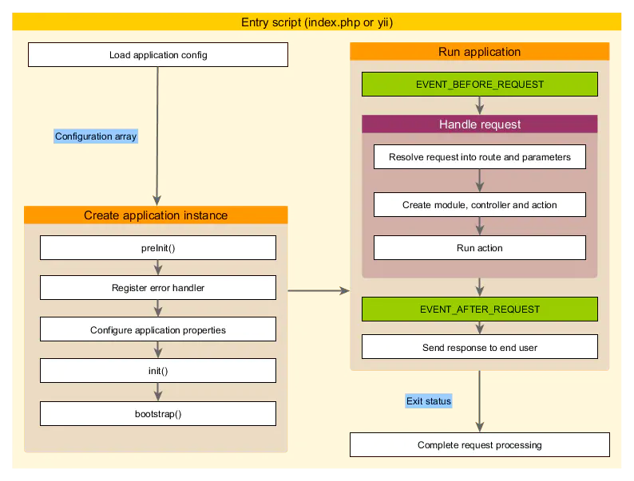

## tp 
### 如何理解TP中的单一入口文件？
ThinkPHP采用单一入口模式进行项目部署和访问，无论完成什么功能，一个项目都有一个统一（但不一定是唯一）的入口。应该说，所有项目都是从入口文件开始的，并且所有的项目的入口文件是类似的，入口文件中主要包括：
定义框架路径、项目路径和项目名称（可选）
定义调试模式和运行模式的相关常量（可选）
载入框架入口文件（必须）---动态加载框架实例

### ThinkPHP中的MVC分层是什么？
MVC 是一种将应用程序的逻辑层和表现层进行分离的方法。ThinkPHP 也是基于MVC设计模式的。MVC只是一个抽象的概念，并没有特别明确的规定，ThinkPHP中的MVC分层大致体现在：
模型（M）：模型的定义由Model类来完成。
控制器（C）：应用控制器（核心控制器App类）和Action控制器都承担了控制器的角色，Action控制器完成业务过程控制，而应用控制器负责调度控制。
视图（V）：由View类和模板文件组成，模板做到了100％分离，可以独立预览和制作。

### 全局函数
S
D
M
C
I


### ThinkPHP如何防止SQL注入？
如果不得已必须使用字符串查询条件，使用预处理机制；
使用字段类型检查、自动验证和自动完成机制等避免恶意数据的输入
开启数据字段类型验证，可以对数值数据类型做强制转换
sql操作能用Array操作就用Array

### 如何开启调试模式？调试模式有什么好处
任何错误信息和调试信息都会详细记录，便于调试。运行日志会更多，更细致
基于缓存的模版，表结构检测会失效

### ThinkPHP框架中D函数与M函数的区别是什么？
在实例化的过程中，经常使用D方法和M方法，这两个方法的区别在于M方法实例化模型无需用户为每个数据表定义模型类，如果D方法没有找到定义的模型类，则会自动调用M方法。
通俗一点说：
M实例化参数是数据库的表名。
D实例化的是你自己在Model文件夹下面建立的模型文件
### TP中系统变量有哪些？如何获取系统变量？
$this->方法名("变量名",["过滤方法"],["默认值"])

### TP中的URL模式有哪几种？默认是哪种？
ThinkPHP支持四种URL模式，可以通过设置URL_MODEL参数来定义，包括普通模式、PATHINFO、REWRITE和兼容模式。
默认模式为：PATHINFO模式，设置URL_MODEL 为1
普通模式：http://localhost/?m=home&c=user&a=login&var=value
PATHINFO模式：http://localhost/index.php/home/user/login?var=value 依然是有效的
REWRITE模式：http://localhost/home/user/login/var/value
入口文件同级新增
```
<IfModule mod_rewrite.c>
 RewriteEngine on
 RewriteCond %{REQUEST_FILENAME} !-d
 RewriteCond %{REQUEST_FILENAME} !-f
 RewriteRule ^(.*)$ index.php/$1 [QSA,PT,L]
</IfModule>
```


## ci 
### CodeIgniter最突出的特点是什么
重量极轻。它基于模型视图控制器（MVC）模式。
它具有全功能的数据库类和对多个平台的支持


## yii

### 源码总结
https://segmentfault.com/a/1190000011823699
https://segmentfault.com/a/1190000010788354
https://www.jianshu.com/p/fb45b6ee6855




###  Active Record
Active Record 提供了一个面向对象的接口， 用以访问和操作数据库中的数据。Active Record 类与数据库表关联， Active Record 实例对应于该表的一行， Active Record 实例的属性表示该行中特定列的值。 您可以访问 Active Record 属性并调用 Active Record 方法来访问和操作存储在数据库表中的数据， 而不用编写原始 SQL 语句。
更直观， 更不易出错

### object类
yii2基本上所有的类都是继承的object类，object类实现了一个接口Configurable
* 1.一个属性通过get和set方法会被定义
* 2.类的属性不区分大小写
* 3.当创建一个对象后既可以通过对象的get和set方法来访问类的属性，也可以访问类的属性

## Di容器

## yii

### 源码
```php
yii\base\Application::__construct
public function __construct($config = [])
{
    Yii::$app = $this;
    $this->setInstance($this);//将\yii\base\Application中的所有的属性和方法交给Yii::$app->loadedModules数组中

    $this->state = self::STATE_BEGIN;

    $this->preInit($config);//加载配置文件的框架信息 如：设置别名，设置框架路径等等 最为重要的是给加载默认组件

    $this->registerErrorHandler($config);//加载配置文件中的异常组件

    Component::__construct($config);//将配置文件中的所有信息赋值给Object，也就是Yii::$app->配置文件参数可以直接调用配置文件的内容 如：Yii::$app->vendorPath//输出框架路径  Yii::$app->components['redis']//输出redis配置信息
}

yii\base\Application::run
public function run()
{
    try {
        $this->state = self::STATE_BEFORE_REQUEST;
        /**
         * trigger 触发通知，将此事件通知给绑定到这个事件的观察者，绑定事件的方法: 
         * yii\base\Component 或者其子类::on("事件名称","方法")
         */
        $this->trigger(self::EVENT_BEFORE_REQUEST);

        $this->state = self::STATE_HANDLING_REQUEST;
        $response = $this->handleRequest($this->getRequest());

        $this->state = self::STATE_AFTER_REQUEST;
        $this->trigger(self::EVENT_AFTER_REQUEST);

        $this->state = self::STATE_SENDING_RESPONSE;
        $response->send();

        $this->state = self::STATE_END;

        return $response->exitStatus;
    } catch (ExitException $e) {
        $this->end($e->statusCode, isset($response) ? $response : null);
        return $e->statusCode;
    }
}
```

## yii\di\ServiceLocator(服务定位器)
优点：
*  Service Locator充当了一个运行时的链接器的角色，可以在运行时动态地修改一个类所要选用的服务， 而不必对类作任何的修改
* 一个类可以在运行时，有针对性地增减、替换所要用到的服务，从而得到一定程度的优化。
* 实现服务提供方、服务使用方完全的解耦，便于独立测试和代码跨框架复用
```php
yii\di\ServiceLocator::set()
unset($this->_components[$id], $this->_definitions[$id]);
```

## 重要部分

// 用于缓存服务、组件等的实例
private $_components = [];

// 用于保存服务和组件的定义，通常为配置数组，可以用来创建具体的实例
private $_definitions = [];

$_singletons // 用于保存单例Singleton对象，以对象类型为键

$_definitions // 用于保存依赖的定义，以对象类型为键

$_params // 用于保存构造函数的参数，以对象类型为键

 $_reflections // 用于缓存ReflectionClass对象，以对象类型为键

 $_dependencies // 用于缓存依赖信息，以对象类型为键

 ## 获取依赖实例化对象
 yii\di\Container::get()
a)如果是已经实例化的单例，直接返回($_singletons)

b)如果是尚未定义（不存在于$_definition），则说明其实例化没有依赖，调用build()

c)存在$_definition
    i.$definition为callable，直接调用
    ii.$definition为数组，根据$definition数组中的‘class’，递归调用get(),递归终止的条件是（当具体实现类就是当前的依赖类时），递归结束时调用build()进行实例化
    iii.$definition为对象，直接返回该对象，并将该对象设置为单例


## laveral
## 


## 依赖倒置（反转）原则（DIP）
一种软件架构设计的原则（抽象概念，是一种思想）
在面向对象编程领域中，依赖反转原则（Dependency inversion principle，DIP）是指一种特定的解耦形式，使得高层次的模块不依赖于低层次的模块的实现细节，依赖关系被颠倒（反转），从而使得低层次模块依赖于高层次模块的需求抽象。

该原则规定：
1.高层次的模块不应该依赖于低层次的模块，两者都应该依赖于抽象接口。
2.抽象接口不应该依赖于具体实现。而具体实现则应该依赖于抽象接口。
通俗的讲，就是高层模块定义接口，低层模块负责实现。

## 控制反转（IoC）
一种反转流、依赖和接口的方式（DIP的具体实现方式，一种设计原则）控制反转（Inversion of Control，缩写为IoC），是面向对象编程中的一种设计原则，可以用来减低计算机代码之间的耦合度。
其中最常见的方式叫做依赖注入（Dependency Injection，简称DI），还有一种方式叫“依赖查找”（Dependency Lookup）。

## 依赖注入（DI）
IoC的一种实现方式，用来反转依赖（IoC的具体实现方式）
依赖注入有如下实现方式：

接口注入（Interface Injection）：实现特定接口以供外部容器注入所依赖类型的对象。
设值注入（Setter Injection）： 实现特定属性的public set方法，来让外部容器调用传入所依赖类型的对象。
构造器注入（Constructor Injection）： 实现特定参数的构造函数，在新建对象时传入所依赖类型的对象。
基于注解 ： 基于Java的注解功能，在私有变量前加“@Autowired”等注解，不需要显式的定义以上三种代码，便可以让外部容器传入对应的对象。

##依赖查找（DL）
IoC的一种实现方式，用来反转依赖
