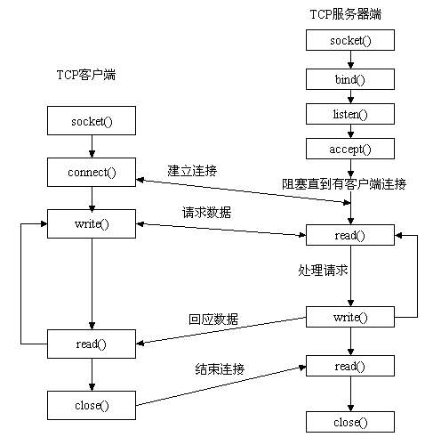

## 参考
> https://www.cnblogs.com/hanqishihu/p/5560767.html
> https://blog.csdn.net/qq_21041889/article/details/83409920
> https://learnku.com/php/t/38272
> 
## echo ,print,print_r的区别
echo 和 print 都不是函数，而是语言结构，所以圆括号都不是必需的。
echo可以输出多个字符串，print只能输出一个
echo 无返回值  print有返回值
print_r用于输出数组对象。
printf 是函数，把文字格式化以后输出
sprintf 是函数，跟printf相似，但不打印，而是返回格式化后的文字
var_dump：函数，输出变量的内容、类型或字符串的内容、类型、长度。常用来调

## isset() 、empty()与is_null的区别
isset()：仅当null和未定义，返回false；
empty()：""、0、"0"、NULL、FALSE、array(),未定义，均返回true；
is_null()：仅判断是否为null，未定义报警告；

## 优雅升级
对于前端是 LVS 这种网络层负载均衡的场景，升级的核心步骤为：升级系统通知 LVS 调度器（Director Server）下线要升级的业务服务器（Real Server）实例。LVS 调度器（Director Server）将该实例从 RS 集合中去除，这样就不再调度新流量到它。升级系统通知要升级的 RS 实例退出。要升级的 RS 实例处理完所有处理中的请求，然后主动退出。升级系统更新 RS 实例到新版本，并重启。升级系统将 RS 实例重新加回 RS 集合参与调度。

## Nginx使用哪种网络协议?
Nginx是一个WEB服务程序，属于应用层,应用层用的是HTTP协议，传输层用的是TCP

## 如何和php交互
https://www.cnblogs.com/ling-diary/p/9292595.html
https://www.jianshu.com/p/eab11cd1bb28
https://segmentfault.com/q/1010000000256516

* (1) 在本机浏览器中输入网址：my.test.com，请求被发送到hosts文件指定的192.168.100.142:80，即我本机虚拟机的80端口；

* (2) 监听192.168.100.142:80的nginx接收到此次请求，由于这是一次Http请求，所以nginx的核心模块会把它交给Http模块来选择合适的Handler模块。

* (3) 经过请求初始化与请求解析，确定请求/{rootPath}/yii/frontend/web/index.php页面的内容。由于这是一个php的请求，nginx会把此次请求交由反向代理模块中的fast-cgi模块，因为nginx不能直接和php通信，他们之间要通过fast-cgi协议才能相互理解。而nginx的fast-cgi模块会遵循fast-cgi协议将请求相关信息发送给proxy_pass指定的fast-cgi上游服务，这里就是指php-fpm；

*  (4) 这个php-fpm是php这一端遵循fast-cgi协议与web server进行通信的服务，这样请求就到了php这一边。

* (5) php-fpm master管理着多个php-fpm worker进程，一次请求到来时它们通过抢夺accept锁的方式获得这次请求的执行权。然后由这个php-fpm worker开始执行这一次请求。

*  (6) 经过一系列的初始化后，由zend引擎对被请求的index.php页面内容进行词法分析和语法分析，生成可以由zend引擎执行的opcode，然后按顺序执行这些opcode，
执行完毕后会进行一系列请求关闭的工作，然后将处理结果反馈给fast-cgi的下游web server；

*  (7) nginx的fast-cgi模块拿到处理结果后，将结果交由一系列Filter模块进行响应内容的过滤与封装，最终反馈到请求终端。

## php多进程、多线程
https://www.jianshu.com/p/4021434d4294
https://blog.csdn.net/Wss0130/article/details/52474595
> php默认是一个进程一个线程。
> PHP使用pcntl来进行多进程编程
  * pcntl_fork
  * 派生子进程的进程，即父进程，其pid不变
  * 对子进程来说，fork()函数返回给它0, 但它自身的pid绝对不会是0；
  * fork之后父、子进程除非采用了同步手段，否则不能确定谁先运行，也不能确定谁先结束
> PHP中使用pthreads来进行多线程编程
> nginx的每个进程只有一个线程，每个线程可以处理多个客户端的访问

## PHP有哪些特性?
> 跨平台
> 支持几乎所有流行的数据库以及操作系统.
> PHP可以使用C,C++进行程序的扩展.
> PHP是一种强大的CGI脚本语言,比其它脚本语言更快

## 写一个函数，尽可能高效的，从一个标准url里取出文件的扩展名?
```
$url="//www.sina.com.cn/abc/de/fg.php?id=1";

arr=parseurl(url);

    ["host"]=>
    string(15) "www.example.com"
    ["path"]=>
    string(5) "/path"
    ["query"]=>
     string(17) "googleguy=googley"

pathArr=pathinfo(arr['path']);
    ['dirname'] => 'abc/de'
    ['basename'] => 'fg.php'
    ['extension'], "PHP"
    ['filename'] => 'fg'

print_r($pathArr['extension']);
```

## php 获取后缀的几种方式
> 1.$info = pathinfo($file); return $info['extension'];
> 2.return end(explode('.', $file));
> 3 substr($file, strrpos($file, '.')+1);
> 4.substr(strrchr($file, '.'), 1);

## 简述两种屏蔽php程序的notice警告的方法?
> 1. 修改PHP的配置文件php.ini error_reporting=E_ALL &  ~E_NOTICE
> 2. 使用error_reporting()函数 int error_reporting ([ int $level ] )

> E_ALL E_NOTICE  E_PARSE E_WARNING E_ERROR

## 递归目录结构
```
    function searchDir($path,&$files){
 
      if (is_dir($path)){
   
        $opendir = opendir($path);
   
        while ($file = readdir($opendir)){
            if($file != '.' && $file != '..'){
            searchDir($path.'/'.$file, $files);
            }
        }
        closedir($opendir);
      }
      if(!is_dir($path)){
         $files[] = $path;
      }
  }
  //得到目录名
  function getDir($dir){
    $files = array();
    searchDir($dir, $files);
    return $files;
  }

  //调用
  $dir = __DIR__;
  $filenames = getDir($dir); 
  foreach ($filenames as $value){
    echo $value.'<br/>';
  }
```

```php
$fp = fopen("/tmp/lock.txt","w+");
      if(flock($fp, LOCK_EX)){// 进行排它型锁定
          fwrite($fp,"Write something here\n");
          flock($fp, LOCK_UN);// 释放锁定
      }else{
          echo "Couldn't lock the file !";
      }
     fclose($fp);

```

##目录文件相关函数
dirname
mkdir 
is_dir
opendir
readdir
closedir

## PHP 是什么？
PHP 是一种基于脚本的 web 语言，开发者可以动态的创建网页

## PHP 的全称？
Hypertext Preprocessor（超文本预处理器)

##  PHP 是否支持多重继承？
PHP 只支持单继承。PHP 的类使用关键字 extends 继承另一个

## 使用 final 修饰的类和方法代表什么意思？
final 是在 PHP5 版本引入的，它修饰的类不允许被继承，它修饰的方法不允许被重写

## PHP 中如何比较两个对象？
我们可以使用运算符 == 来比较两个对象是否为同一个类的实例，并且拥有相同的属性和属性值。
还可以是使用运算符 === 来比较两个对象是否引用了同一类的同一实例。

## PHP 和 HTML 是如何交互的？
可以通过 PHP 脚本生成 HTML，还可以将信息从 HTML 传递到 PHP。

## PHP 处理图片需要添加什么扩展？
需要 GD 库来执行处理图片功能。

## 获取图片属性（size, width, 和 height）的函数是什么？
获取图片大小 size：getimagesize ()；获取图片宽度 width：imagesx ()；获取图片高度 height：imagesy ()。

##  如何为 PHP 脚本设置无限执行时间？
在脚本开始处添加 set_time_limit (0) 设置为无限执行时间，以避免 PHP 错误 “超过最大执行时间”

## 如何使用 PHP 脚本 连接 MySQL 数据库？
$database = mysqli_connect("HOST", "USER_NAME", "PASSWORD"); 
mysqli_select_db($database,"DATABASE_NAME"); 

## 如何在 PHP 中处理 MySQL 的结果集？
mysqli_fetch_array, mysqli_fetch_assoc, mysqli_fetch_object or mysqli_fetch_row 

## mysqli_fetch_array mysqli_fetch_assoc mysqli_fetch_row
mysqli_fetch_array() 函数从结果集中取得一行作为关联数组，或数字数组，或二者兼有
mysqli_fetch_assoc()用关键字索引取值。
但是mysqli_fetch_row()用数字索引取值


## unlink () 函数的作用是？
unlink () 函数专用于文件系统处理。它用于删除文件。

## include、include_once
https://www.cnblogs.com/phpfensi/p/7861127.html

## 解释是否可以在多个 PHP 项目之间共享单个 memcache 实例？
是的，可以在多个项目之间共享一个 Memcache 实例。 Memcache 是​​一个内存存储空间，您可以在一个或多个服务器上运行 memcache。您还可以将客户端配置为与特定实例集进行对话

## 是否可以销毁 Cookie ？
是的，可以通过设置 cookie 的过期时间来实现。设置expire为当前时间之前的时候，或者把cookie的值置为空

## PHP 中可能出现的三类错误是什么？
三类基本错误类别是： 通知 (非关键错误)、警告 (严重错误) 和 致命错误 (严重错误)。

## 是否可以保护查询字符串中的特殊字符？
是的， 我们使用 urlencode () 函数 来保护特殊字符。  
url有一些限制所以，需要对一些字符进行替换，换成 % + 16进制
-_.    空格-> +

## 表达式 Exception::__toString 是什么意思？
Exception::__toString 给出异常的字符串表示形式。

##Exception::getMessage 和 Exception:: getLine 有什么区别？
Exception::getMessage 让我们得到异常消息， Exception::getLine 让我们得到发生异常的行。

##  如何确定 PHP 变量是否是某个类的实例化对象？
我们用 instanceof 能够验证 PHP 变量是否是某个类的实例话对象。

## 如何更改要上传的文件大小的最大值？
可通过更改 php.ini 中的 upload_max_filesize 来更改要上传的文件的最大大小。

## 上传文件出问题时，如何获取错误信息
$_FILES['userfile']['error'] 包括了与上传文件有关的错误代码。

## 如何在 PHP 中启动会话？
使用 session_start() 函数可以激活会话。

## $ _SERVER 是什么意思？
$_SERVER 是一个包含 Web 服务器创建信息的数组，包括了路径，头部和脚本位置等

## 在 PHP 中，对象是按值传递还是按引用传递？
对象按值传递。

## 哪种加密扩展可以生成和验证数字签名？
PHP-OpenSSL 扩展提供了几种加密操作，包括数字签名的生成和验证。

## 如何在 PHP 中强制转换类型？
出类型的名称必须在要强制转换的变量前的括号中指定，
(int), (integer) - 强制转换为整型
(string) - 强制转换为字符串
(object) - 强制转换为对象


## 转义问题
addslashes()通过用于防止sql语句注入，在执行sql语句前对通过get、post和cookie传递来的参数中的单引号，双引号，\ 和null进行转义。
get_magic_quotes_gpc --->可以查看启用魔术引号项的开启情况
htmlspecialchars()也是对字符进行转义，与addslashes（）不同的是htmlspecialchars()是将特殊字符用引用实体替换。避免执行被注入的脚本。
https://www.cnblogs.com/yingww/p/4290849.html


## 传值问题
传值。

## 什么方法来加快页面的加载速度
1，用到服务器资源时在打开，不用时，立即关闭服务器资源。
2，数据库添加索引
3，页面可生成静态
4，图片等大文件单独放在一个服务器
5，能不查询数据库的尽量不去数据取数据，可以放在缓存中。

## 对于大流量网站，采用什么方法解决访问量问题？
1.优化数据库的访问
2.使用不同主机分流主要流量
3.确认服务器的硬件是否足够支持当前的流量
4.使用流量分析统计软件

## MYSQL取得当前时间的函数是?，格式化日期的函数
select now();   2008-08-08 22:20:46 ;
FROM_UNIXTIME(1557763200, '%Y-%m-%d %H:%i:%s')   2019-05-14 00:00:00
unix_timestamp()   1557763200
DATE(2008-12-29 16:25:46.635)  2008-12-29
DATE_FORMAT(date,format) 对日期进行格式输出
参考
https://www.jianshu.com/p/39d7c2f516ba

## 用PHP写出显示客户端IP与服务器IP 
客户端：
$_SERVER[‘REMOTE_ADDR’];
$_SERVER['HTTP_CLIENT_IP'];代理端的IP，可能存在，也可能伪造
$_SERVER['HTTP_X_FORWARD_FOR'] ：用户在哪个ip上使用的id，可能存在，也可能伪造
ip2long() ip转成数字类型
服务器： 
gethostbyname($_SERVER['SERVER_NAME']);
$_SERVER['SERVER_ADDR']

## 能够使HTML和PHP分离开使用的模板(
  Smarty,Twig，Plates
  https://qq52o.me/1263.html

## php的闭包和匿名函数
闭包和匿名函数是不同的概念，不过，php将其视作相同的概念，所以，我提到闭包时，指的也是匿名函数
https://blog.csdn.net/qq_38287952/article/details/83104718

应用：array_map 的实现

## php的设计模式
### 单例
整个应用中只有一个实例对象的设计模式。
单例模式的要点：
构造函数需要标记为private（访问控制：防止外部代码使用new操作符创建对象），单例类不能在其他类中实例化，只能被其自身实例化；
拥有一个保存类的实例的静态成员变量
拥有一个访问这个实例的公共的静态方法（常用getInstance()方法进行实例化单例类，通过instanceof操作符可以检测到类是否已经被实例化）
私有静态属性（privite static $instance），又来储存生成的唯一对象
私有构造函数 (privite __contruct())
私有克隆函数(privite function __clone())，防止克隆——clone
公共静态方法(public static function getInstance())，用来访问静态属性储存的对象，如果没有对象，则生成此单例
关键词instanceof，检查此变量是否为该类的对象、子类、或是实现接口。
https://www.cnblogs.com/chrdai/p/11182665.html

### 迭代器模式
https://segmentfault.com/a/1190000007547513
定义：那就是提供一种方法顺序访问一个聚合对象中各个元素，而又不暴露该对象的内部显示。它可帮助构造特定的对象，那些对象能够提供单一标准接口循环或迭代任何类型的可计数数据
https://blog.csdn.net/luyaran/article/details/82867878

###  设计模式之命令模式
https://www.cnblogs.com/dawuge/p/9400831.html
将一个请求封装为一个对象，从而使用户可用不同的请求对客户进行参数化。对请求排队或记录请求日志，以及支持撤销的操作。
命令模式的四种角色：

1. 接收者（Receiver）负责执行与请求相关的操作
2. 命令接口（Command）封装execute()、undo()等方法
3. 具体命令（ConcreteCommand）实现命令接口中的方法
4. 请求者（Invoker）包含Command接口变量

### 策略模式
https://www.cnblogs.com/houdabao/p/9546871.html
策略模式就是使用封装一个公共抽象算法，每个算法（比如，打折算法，满减算法）实现这个接口，然后搞个策略工厂类来调用这些算法。（感觉和工厂模式类似）
和工厂的区别：
同：
在结构上相似，都是对象的继承和多态，所以非常难区分。
异：
个人感觉工厂是对不同对象，但是相同动作的一个聚合。 工厂是不同动作的分发。


## HP异常处理（级别，错误日志，控制错误输出）
联系项目深化

## 编码：Unicode和UTF-8之间的关系
https://blog.csdn.net/wzx1286474341/article/details/80620631

## 正则
### 特殊字符
* 0到多次
+ 1到多次还可以写成{1,}
? 0或1次
. 匹配除换行符外的所有单个的字符
\w [a-zA-Z0-9_]
\s 空白字符(空格，换行符，回车符）[\t\n\r]
\d [0-9]

### 常用函数
preg_match 执行一个正则表达式匹配，返回 pattern 的匹配次数。
preg_match_all 执行一个全局正则表达式匹配
preg_replace  执行一个正则表达式的搜索和替换
preg_grep 返回匹配模式的数组条目
https://www.jianshu.com/p/ab7904e45a1f
###
^ 开始
$ 结束
### 常用正则
匹配中文字符的正则表达式： [\u4e00-\u9fa5] 
手机号码：preg_match('/^1[0-9]{10}$/', $strTel) < 1 ? false : true;
邮箱： ^[A-Za-z0-9\u4e00-\u9fa5]+@[a-zA-Z0-9_-]+(\.[a-zA-Z0-9_-]+)+$


### 模式
i 模式中的字符将同时匹配大小写字母.
s 将字符串视为单行,换行符作为普通字符.
m 字符串视为多行

## socket编程和swoole
https://www.cnblogs.com/WuNaiHuaLuo/p/6107771.html
https://www.cnblogs.com/loveyoume/p/6076101.html
### Socket是什么呢？
Socket是应用层与TCP/IP协议族通信的中间软件抽象层，它是一组接口。在设计模式中，Socket其实就是一个门面模式，它把复杂的TCP/IP协议族隐藏在Socket接口后面，对用户来说，一组简单的接口就是全部，让Socket去组织数据，以符合指定的协议。
先从服务器端说起。服务器端先初始化Socket，然后与端口绑定(bind)，对端口进行监听(listen)，调用accept阻塞，等待客户端连接。在这时如果有个客户端初始化一个Socket，然后连接服务器(connect)，如果连接成功，这时客户端与服务器端的连接就建立了。客户端发送数据请求，服务器端接收请求并处理请求，然后把回应数据发送给客户端，客户端读取数据，最后关闭连接，一次交互结束



##不用新变量直接交换现有两个变量的值
1.list($a, $b) = array($b, $a);
2.     $a = $b.','.$a ; $a = explode(',', $a); $b = $a[1];$a = $a[0];


## json
JSON是一个标记符的序列。这套标记符包含六个构造字符、字符串、数字和三个字面名。
JSON是一个序列化的对象或数组。


## php获取文件内容的方法，对应的函数
1：file_get_contents得到文件的内容（可以以get和post的方式获取），整个文件读入一个字符串中
2：用fopen打开url, 以get方式获取内容（借助fgets()函数）
3：用fsockopen函数打开url（可以以get和post的方式获取），以get方式获取完整的数据，包括header和body
https://www.php.net/manual/zh/function.fsockopen.php

## php的方法重载和重写
提供了创建同名的多个方法的能力，但这些方法需使用不同的参数类型。由于 php 是弱类型的语言,对于方法中的参数类型我们可以忽略， 中原生不支持创建多个同名方法的能力。
重写就是子类将父类的实现替换为自己的实现，这就是方法重写 Override，或者叫做方法覆写。


## PHP缓存技术有哪些? tp是局部还是完全缓存?
常用的缓存技术有：redis和memcache
全页面静态化缓存，也就是将页面全部生成html静态页面，用户访问时直接访问的静态页面，而不会去走php服务器解析的流程
页面部分缓存，将一个页面中不经常变的部分进行静态缓存，而经常变化的块不缓存，最后组装在一起显示
数据缓存，通过一个id进行请求的数据,将数据缓存到一个php文件中,id和文件是对应的,下次通过这个id进行请求时 直接读php文件

## 单例
https://www.cnblogs.com/sgm4231/p/9851725.html
二、PHP单例模式三要素
1. 需要一个保存类的唯一实例的静态成员变量。
2. 构造函数和克隆函数必须声明为私有的，防止外部程序创建或复制实例副本。
3. 必须提供一个访问这个实例的公共静态方法，从而返回唯一实例的一个引用。
```php
private static $instance = null;
//保存用户的自定义配置参数
private $setting = [];
//构造器私有化:禁止从类外部实例化
private function __construct(){}
//克隆方法私有化:禁止从外部克隆对象
private function __clone(){}
        //因为用静态属性返回类实例,而只能在静态方法使用静态属性
        //所以必须创建一个静态方法来生成当前类的唯一实例
public static function getInstance()
{
            //检测当前类属性$instance是否已经保存了当前类的实例
            if (self::$instance == null) {
                //如果没有,则创建当前类的实例
                self::$instance = new self();
            }
            //如果已经有了当前类实例,就直接返回,不要重复创建类实例
            return self::$instance;
}
//假如是数据库，初始化有动作，在构造函数内实例
```

## php与redis连接
https://www.cnblogs.com/JohnABC/p/6012112.html

## GC
在php中，每个变量存在一个叫“zval”的变量容器中。一个zval变量容器，除了包含变量的类型和值，还包括另外两个字节的额外信息。第一个是"is_ref"。第二个是"refcount"。

is_ref是一个布尔类型的值，用来标示这个变量是否属于引用集合。通过这个字节，php引擎才能把普通变量和引用变量区分开来，由于php允许用户通过"&"来使用自定义的引用，所以zval中还有一个内部引用计数机制，来进行优化内存。

refcount用来表示这个zval变量容器的变量的个数。所有符号存在一个符号表当中，每个符号都有作用域。

通俗的讲：

refcount就是多少个变量是一样的用了相同的值，那么refcount就是这个值
is_ref就是当有变量用了&的形式进行赋值，那么is_ref的值就会增加

## 编译缓存
Nginx接收客户端的PHP程序访问请求
Nginx根据扩展名等过滤规则将PHP程序请求传递给解析PHP的FCGI（PHP FPM）进程
PHP FPM进程调用PHP解析器读取站点磁盘上的PHP文件，并加载到内存中
PHP解析器将PHP程序编译成为opcode文件，然后把opcode缓存起来
PHP FPM引擎执行opcode树后，返回数据给Nginx，进而返回客户端
Nginx接收客户新的PHP程序请求，PHP FPM引擎就会直接读取缓存中的opcode并执行，将结果返回

## 浏览器缓存
https://segmentfault.com/a/1190000017962411
### 强缓存
浏览器在加载资源时，会先根据本地缓存资源的 header 中的信息判断是否命中强缓存，如果命中则直接使用缓存中的资源不会再向服务器发送请求。
> 这里的 header 中的信息指的是 expires 和 cahe-control.

### 协商缓存

## XHProf
和goprofile类似，是一个扩展
引入配置后，可以生成性能图直观查看
https://segmentfault.com/a/1190000018856380

