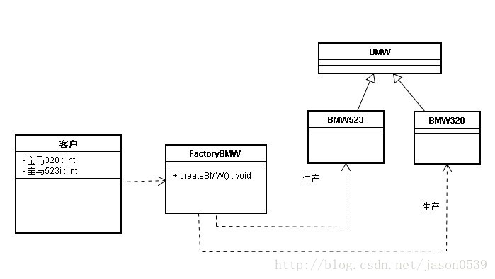
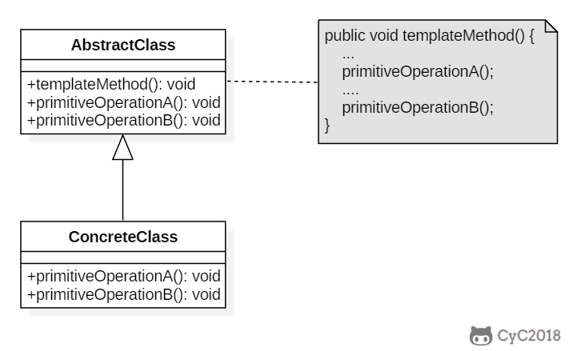

>  重点掌握：适配器模式，装饰模式，策略模式，模板模式，观察者模式，单例模式，工厂模式，代理模式
>
>  spring：适配器模式（sprngmvc），代理模式(AOP)，工厂模式(BeanFactory)，单例模式

[推荐博客](https://www.cnblogs.com/WindSun/category/1376525.html)


# 🎃 创建型

## 1 单例模式（Singleton）
指一个类只有一个实例，且该类能自行创建这个实例的一种模式。


good:
1.在内存里只有一个实例，减少了内存的开销，尤其是频繁的创建和销毁实例
2.避免对资源的多重占用（比如写文件操作）。
bad:
1.没有接口，不能继承，与单一职责原则冲突，一个类应该只关心内部逻辑，而不关心外面怎么样来实例化。

单例模式有以下特点：  

1. 单例类只能有一个实例。  
2. 单例类必须自己创建自己的唯一实例。  
3. 单例类必须给所有其他对象提供这一实例。 


适用场景：

在计算机系统中，线程池、缓存、日志对象、对话框、打印机、显卡的驱动程序对象常被设计成单例。这些应用都或多或少具有资源管理器的功能。


### 

### 1.1 懒汉式

#### 1.1.1 线程不安全

以下实现中，私有静态变量 single被延迟实例化，这样做的好处是，如果没有用到该类，那么就不会实例化 single，从而节约资源。

这个实现在多线程环境下是不安全的，如果多个线程能够同时进入 `if (single== null)` ，并且此时 single为 null，那么会有多个线程执行 `single= new Singleton();` 语句，这将导致实例化多次 Singleton。

```java
public class Singleton {
    private static Singleton single=null;
    private Singleton() {}
    //静态工厂方法 
    public static Singleton getInstance() {
         if (single == null) {  
             single = new Singleton();
         }  
        return single;
    }
}
```
```go
package singleton
import "sync"

var (
    instance *Instance
    lock     sync.Mutex
)

type Instance struct {
    Name string
}

// 双重检查
func GetInstance(name string) *Instance {
    if instance == nil {
        lock.Lock()
        defer lock.Unlock()
        if instance == nil {
            instance = &Instance{Name: name}
        }
    }
    return instance
}
```


#### 1.1.3 双重校验锁-线程安全

single只需要被实例化一次，之后就可以直接使用了。加锁操作只需要对实例化那部分的代码进行，只有当 single没有被实例化时，才需要进行加锁。

双重校验锁先判断 single是否已经被实例化，如果没有被实例化，那么才对实例化语句进行加锁。

```java
 public class Singleton {
    private volatile static Singleton single=null;
    private Singleton() {}
     
   public static Singleton getInstance() {
        if (single == null) {  
            synchronized (Singleton.class) {  
               if (single == null) {  
                  single = new Singleton(); 
               }  
            }  
        }  
        return single; 
    }
}
```
#


#### 1.1.4 静态内部类实现

当 Singleton 类被加载时，静态内部类 LazyHolder没有被加载进内存。只有当调用 `getInstance()` 方法从而触发 `LazyHolder.INSTANCE` 时 LazyHolder 才会被加载，此时初始化 INSTANCE 实例，并且 JVM 能确保 INSTANCE 只被实例化一次。

这种方式不仅具有延迟初始化的好处，而且由 JVM 提供了对线程安全的支持。

>这种比上面sychronized和双重检索锁方法都好一些，既实现了线程安全，又避免了同步带来的性能影响。 

```java
public class Singleton {  
    private static class LazyHolder {  
       private static final Singleton INSTANCE = new Singleton();  
    }  
    private Singleton (){}  
    public static final Singleton getInstance() {  
       return LazyHolder.INSTANCE;  
    }  
}  
```

#### 1.1.5 语言风格的单例模式
```go
package singleton

import "sync"

var (
    goInstance *Instance
    once       sync.Once
)

// 使用go 实现单例模式
func GoInstance(name string) *Instance {
    if goInstance == nil {
        once.Do(func() {
            goInstance = &Instance{
                Name: name,
            }
        })
    }
    return goInstance
}
```

### 1.2 饿汉式-线程安全

线程不安全问题主要是由于 single被实例化多次，采取直接实例化 single 的方式就不会产生线程不安全问题。

但是直接实例化的方式也丢失了延迟实例化带来的节约资源的好处。

```java
//饿汉式单例类.在类初始化时，已经自行实例化 
public class Singleton1 {
    private Singleton1() {}
    private static final Singleton1 single = new Singleton1();
    //静态工厂方法 
    public static Singleton1 getInstance() {
        return single;
    }
}
```


## 2 工厂模式

  工厂模式主要是为创建对象提供过渡接口，以便将创建对象的具体过程屏蔽隔离起来，达到提高灵活性的目的。 
工厂模式可以分为三类： 

1. 简单工厂模式（Simple Factory） 

2. 工厂方法模式（Factory Method） 
3. 抽象工厂模式（Abstract Factory） 

这三种模式从上到下逐步抽象，并且更具一般性。 
GOF在《设计模式》一书中将工厂模式分为两类：工厂方法模式与抽象工厂模式

将简单工厂模式看为工厂方法模式的一种特例，两者归为一类。 


**区别 ：**

* 工厂方法模式：

  一个抽象产品类，可以派生出多个具体产品类。   
  一个抽象工厂类，可以派生出多个具体工厂类。   
  每个具体工厂类只能创建一个具体产品类的实例。

* 抽象工厂模式：

  多个抽象产品类，每个抽象产品类可以派生出多个具体产品类。   
  一个抽象工厂类，可以派生出多个具体工厂类。   
  每个具体工厂类可以创建多个具体产品类的实例。   


### 2.1 简单工厂模式

### intent

简单工厂把实例化的操作单独放到一个类中，这个类就成为简单工厂类，让简单工厂类来决定应该用哪个具体子类来实例化。
如果在抽象类中限制接口的化，还可以起到约束接口的作用。统一创建，相同的使用。

### Class Diagram




### Implementation

产品类： 

```java
abstract class BMW {
	public BMW(){
		
	}
}
```

```java
public class BMW320 extends BMW {
	public BMW320() {
		System.out.println("制造-->BMW320");
	}
}
public class BMW523 extends BMW{
	public BMW523(){
		System.out.println("制造-->BMW523");
	}
}
```


工厂类： 

```java
public class Factory {
	public BMW createBMW(int type) {
		switch (type) {
		
		case 320:
			return new BMW320();
 
		case 523:
			return new BMW523();
 
		default:
			break;
		}
		return null;
	}
}
```

客户类： 

```java
public class Customer {
	public static void main(String[] args) {
		Factory factory = new Factory();
		BMW bmw320 = factory.createBMW(320);
		BMW bmw523 = factory.createBMW(523);
	}
}
```


### 2.2 工厂方法模式

### intent

定义了一个创建对象的工厂接口，工厂来实例化对象，但由子类决定要实例化哪个类。工厂方法把实例化操作推迟到子类。

与简单工厂不同，这里给工厂定义了一个接口，并且定义了多个不同工厂，每个工厂负责一款产品。


### Class Diagram


### Implementation

```java

public interface IRuleConfigParserFactory {
  IRuleConfigParser createParser();
}

public class JsonRuleConfigParserFactory implements IRuleConfigParserFactory {
  @Override
  public IRuleConfigParser createParser() {
    return new JsonRuleConfigParser();
  }

}


public class RuleConfigSource {
  public RuleConfig load(String ruleConfigFilePath) {
    String ruleConfigFileExtension = getFileExtension(ruleConfigFilePath);

    IRuleConfigParserFactory parserFactory = RuleConfigParserFactoryMap.getParserFactory(ruleConfigFileExtension);
    if (parserFactory == null) {
      throw new InvalidRuleConfigException("Rule config file format is not supported: " + ruleConfigFilePath);
    }
    IRuleConfigParser parser = parserFactory.createParser();

    String configText = "";
    //从ruleConfigFilePath文件中读取配置文本到configText中
    RuleConfig ruleConfig = parser.parse(configText);
    return ruleConfig;
  }

  private String getFileExtension(String filePath) {
    //...解析文件名获取扩展名，比如rule.json，返回json
    return "json";
  }
}

//因为工厂类只包含方法，不包含成员变量，完全可以复用，
//不需要每次都创建新的工厂类对象，所以，简单工厂模式的第二种实现思路更加合适。
public class RuleConfigParserFactoryMap { //工厂的工厂
  private static final Map<String, IRuleConfigParserFactory> cachedFactories = new HashMap<>();

  static {
    cachedFactories.put("json", new JsonRuleConfigParserFactory());
    cachedFactories.put("xml", new XmlRuleConfigParserFactory());
    cachedFactories.put("yaml", new YamlRuleConfigParserFactory());
    cachedFactories.put("properties", new PropertiesRuleConfigParserFactory());
  }

  public static IRuleConfigParserFactory getParserFactory(String type) {
    if (type == null || type.isEmpty()) {
      return null;
    }
    IRuleConfigParserFactory parserFactory = cachedFactories.get(type.toLowerCase());
    return parserFactory;
  }
}
```


### 使用场景
1.类似规则配置解析的例子，代码中存在 if-else 分支判断，动态地根据不同的类型创建不同的对象。针对这种情况，我们就考虑使用工厂模式，将这一大坨 if-else 创建对象的代码抽离出来，放到工厂类中。
2.还有一种情况，尽管我们不需要根据不同的类型创建不同的对象，但是，单个对象本身的创建过程比较复杂，比如前面提到的要组合其他类对象，做各种初始化操作。推荐使用工厂方法模式


# :christmas_tree: 行为型

## 1 观察者

### Intent

观察者模式定义了对象间的一种一对多的依赖关系，当一个对象的状态发生改变时，所有依赖于它的对象都将得到通知，并自动更新。 


### Class Diagram

主题（Subject）具有注册和移除观察者、并通知所有观察者的功能，主题是通过维护一张观察者列表来实现这些操作的。

观察者（Observer）的注册功能需要调用主题的 registerObserver() 方法。

 </div><br>

### Implementation

天气数据布告板会在天气信息发生改变时更新其内容，布告板有多个，并且在将来会继续增加。


```java
public interface Subject {
    void registerObserver(Observer o);

    void removeObserver(Observer o);

    void notifyObserver();
}
```

```java
public class WeatherData implements Subject {
    //观察者
    private List<Observer> observers;
    private float temperature;
    private float humidity;
    private float pressure;

    public WeatherData() {
        observers = new ArrayList<>();
    }

    public void setMeasurements(float temperature, float humidity, float pressure) {
        this.temperature = temperature;
        this.humidity = humidity;
        this.pressure = pressure;
        notifyObserver();
    }

    @Override
    public void registerObserver(Observer o) {
        observers.add(o);
    }

    @Override
    public void removeObserver(Observer o) {
        int i = observers.indexOf(o);
        if (i >= 0) {
            observers.remove(i);
        }
    }

    //通知观察者所有的改变
    @Override
    public void notifyObserver() {
        for (Observer o : observers) {
            o.update(temperature, humidity, pressure);
        }
    }
}
```

```java
public interface Observer {
    void update(float temp, float humidity, float pressure);
}
```

```java
public class StatisticsDisplay implements Observer {

    public StatisticsDisplay(Subject weatherData) {
        weatherData.registerObserver(this);
    }

    @Override
    public void update(float temp, float humidity, float pressure) {
        System.out.println("StatisticsDisplay.update: " + temp + " " + humidity + " " + pressure);
    }
}
```

```java
public class CurrentConditionsDisplay implements Observer {

    public CurrentConditionsDisplay(Subject weatherData) {
        weatherData.registerObserver(this);
    }

    @Override
    public void update(float temp, float humidity, float pressure) {
        System.out.println("CurrentConditionsDisplay.update: " + temp + " " + humidity + " " + pressure);
    }
}
```


测试：

```java
public class WeatherStation {
    public static void main(String[] args) {
        WeatherData weatherData = new WeatherData();
        CurrentConditionsDisplay currentConditionsDisplay = new CurrentConditionsDisplay(weatherData);
        StatisticsDisplay statisticsDisplay = new StatisticsDisplay(weatherData);

        weatherData.setMeasurements(0, 0, 0);
        weatherData.setMeasurements(1, 1, 1);
    }
}
```


```html
CurrentConditionsDisplay.update: 0.0 0.0 0.0
StatisticsDisplay.update: 0.0 0.0 0.0
CurrentConditionsDisplay.update: 1.0 1.0 1.0
StatisticsDisplay.update: 1.0 1.0 1.0
```


### 应用场景

观察者模式的一个扩展应用是发布订阅模式。


**观察者模式：**观察者（Observer）直接订阅（Subscribe）主题（Subject），而当主题被激活的时候，会触发（Fire Event）观察者里的事件。 

**发布订阅模式：**订阅者（Subscriber）把自己想订阅的事件注册（Subscribe）到调度中心（Topic），当发布者（Publisher）发布该事件（Publish  topic）到调度中心，也就是该事件触发时，由调度中心统一调度（Fire Event）订阅者注册到调度中心的处理代码。

区别：

观察者模式和发布订阅模式最大的区别就是发布订阅模式有个事件调度中心。

观察者模式由具体目标调度，每个被订阅的目标里面都需要有对观察者的处理，这种处理方式比较直接粗暴，但是会造成代码的冗余。

而发布订阅模式中统一由调度中心进行处理，订阅者和发布者互不干扰，消除了发布者和订阅者之间的依赖。这样一方面实现了解耦，还有就是可以实现更细粒度的一些控制。比如发布者发布了很多消息，但是不想所有的订阅者都接收到，就可以在调度中心做一些处理，类似于权限控制之类的。还可以做一些节流操作。


## 2 策略

### Intent

 策略模式是对算法的包装,把使用算法的责任和算法本身分隔开,委派给不同的对象管理。 

**根据传入的对象类型，就可以确定在算法包装类中调用哪一个算法。所以如果要增加一个新的算法，只要让此类实现指定接口并且实现相应方法就行了。**

### Class Diagram

- Strategy 接口定义了一个算法族，它们都实现了  behavior() 方法。
- Context 是使用到该算法族的类，其中的 doSomething() 方法会调用 behavior()，setStrategy(Strategy) 方法可以动态地改变 strategy 对象，也就是说能动态地改变 Context 所使用的算法。


策略模式本质是将相同的行为抽象聚合化
策略模式主要是用来封装一组可以互相替代的算法族，并且可以根据需要动态地去替换 Context 使用的算法。

### Implementation

设计一个鸭子，它可以动态地改变叫声。这里的算法族是鸭子的叫声行为。

```java
public interface QuackBehavior {
    void quack();
}
```

```java
public class Quack implements QuackBehavior {
    @Override
    public void quack() {
        System.out.println("quack!");
    }
}
```

```java
public class Squeak implements QuackBehavior{
    @Override
    public void quack() {
        System.out.println("squeak!");
    }
}
```

```java
public class Duck {

    private QuackBehavior quackBehavior;

    public void performQuack() {
        if (quackBehavior != null) {
            quackBehavior.quack();
        }
    }

    public void setQuackBehavior(QuackBehavior quackBehavior) {
        this.quackBehavior = quackBehavior;
    }
}
```

```java
public class Client {

    public static void main(String[] args) {
        Duck duck = new Duck();
        duck.setQuackBehavior(new Squeak());
        duck.performQuack();
        duck.setQuackBehavior(new Quack());
        duck.performQuack();
    }
}
```

```html
squeak!
quack!
```


### 应用场景

电商网站支付方式，一般分为银联、微信、支付宝，可以采用策略模式，为每一种方式，作为一种支付方式的实现，如果哪一个支付方式方式，发生了变化，只要修改对应的实现即可，不需要修改调用的客户端

如果引入新的支付，如万里通支付，增加一个对应的万里通支付**实现类**，遵循了开闭原则。


## 3 模板

### Intent

定义算法框架，并将一些步骤的实现延迟到子类，复用那些相同步骤的代码。

通过模板方法，子类可以重新定义算法的某些步骤，而不用改变算法的结构。

### 作用
复用和扩展。
扩展：代码的扩展性，而是指框架的扩展性。

### Class Diagram



### Implementation

冲咖啡和冲茶都有类似的流程，但是某些步骤会有点不一样，要求复用那些相同步骤的代码。


```java
public abstract class CaffeineBeverage {

    final void prepareRecipe() {
        boilWater();
        brew();
        pourInCup();
        addCondiments();
    }

    abstract void brew();

    abstract void addCondiments();

    void boilWater() {
        System.out.println("boilWater");
    }

    void pourInCup() {
        System.out.println("pourInCup");
    }
}
```

```java
public class Coffee extends CaffeineBeverage {
    @Override
    void brew() {
        System.out.println("Coffee.brew");
    }

    @Override
    void addCondiments() {
        System.out.println("Coffee.addCondiments");
    }
}
```

```java
public class Tea extends CaffeineBeverage {
    @Override
    void brew() {
        System.out.println("Tea.brew");
    }

    @Override
    void addCondiments() {
        System.out.println("Tea.addCondiments");
    }
}
```

```java
public class Client {
    public static void main(String[] args) {
        CaffeineBeverage caffeineBeverage = new Coffee();
        caffeineBeverage.prepareRecipe();
        System.out.println("-----------");
        caffeineBeverage = new Tea();
        caffeineBeverage.prepareRecipe();
    }
}
```

```html
boilWater
Coffee.brew
pourInCup
Coffee.addCondiments
-----------
boilWater
Tea.brew
pourInCup
Tea.addCondiments
```
### go
```go
package doc

import "fmt"

type DocSuper struct {
    GetContent func() string
}

func (d DocSuper) DoOperate() {
    fmt.Println("对这个文档做了一些处理,文档是:", d.GetContent())
}

----------
package doc

type LocalDoc struct {
    DocSuper
}

func NewLocalDoc() *LocalDoc {
    c := new(LocalDoc)
    c.DocSuper.GetContent = c.GetContent
    return c
}

func (e *LocalDoc) GetContent() string {
    return "this is a LocalDoc."
}
--------
package main

import . "doc"

func main() {
    netDoc := NewNetDoc()
    netDoc.DoOperate()
}
```


# :mushroom: 结构型

## 1 适配器（Adapter）

### Intent

把一个类的接口变换成客户端所期待的另一种接口，从而使原本因接口原因不匹配而无法一起工作的两个类能够一起工作 


### Class Diagram

 

**角色：**

- 目标接口：Target，该角色把其他类转换为我们期望的接口
- 被适配者: Adaptee 原有的接口，也是希望被改变的接口
- **适配器**： Adapter, 将被适配者和目标接口组合到一起的类

就是定义了一个适配器继承目标接口，然后在适配器中调用被适配者的代码。
本质把被适配者组合过来，当前类的方法接口调用时，对被适配者方法进行处理。


### Implementation

鸭子（Duck）和火鸡（Turkey）拥有不同的叫声，Duck 的叫声调用 quack() 方法，而 Turkey 调用 gobble() 方法。

要求将 Turkey 的 gobble() 方法适配成 Duck 的 quack() 方法，从而让火鸡冒充鸭子！

```java
public interface Duck {
    void quack();
}
```

```java
public interface Turkey {
    void gobble();
}
```

```java
public class WildTurkey implements Turkey {
    @Override
    public void gobble() {
        System.out.println("gobble!");
    }
}
```

```java
public class TurkeyAdapter implements Duck {
    Turkey turkey;

    public TurkeyAdapter(Turkey turkey) {
        this.turkey = turkey;
    }

    @Override
    public void quack() {
        turkey.gobble();
    }
}
```

```java
public class Client {
    public static void main(String[] args) {
        Turkey turkey = new WildTurkey();
        Duck duck = new TurkeyAdapter(turkey);
        duck.quack();
    }
}
```


### 应用场景

[博客，写的超级好](https://www.imooc.com/article/15110)

适配器模式从**实现方式**上分为两种，**类适配器和对象适配器**，这两种的区别在于实现方式上的不同，一种采用继承，一种采用组合的方式。  

另外从**使用目的**上来说，也可以分为两种，**特殊适配器和缺省适配器**，一种为了复用原有的代码并适配当前的接口，一种为了提供缺省的实现，避免子类需要实现不该实现的方法。 


## 2 装饰/包装（Decorator）

### Intent

为对象动态添加功能。
第一个比较特殊的地方是：装饰器类和原始类继承同样的父类，这样我们可以对原始类“嵌套”多个装饰器类
第二个比较特殊的地方是：装饰器类是对功能的增强，这也是装饰器模式应用场景的一个重要特点

### Class Diagram

装饰模式指的是在不必改变原类文件和使用继承的情况下，动态地扩展一个对象的功能。它是通过创建一个包装对象，也就是装饰来包裹真实的对象。 


### Implementation

设计不同种类的饮料，饮料可以添加配料，比如可以添加牛奶，并且支持动态添加新配料。每增加一种配料，该饮料的价格就会增加，要求计算一种饮料的价格。

下图表示在 DarkRoast 饮料上新增新添加 Mocha 配料，之后又添加了 Whip 配料。DarkRoast 被 Mocha 包裹，Mocha 又被 Whip 包裹。它们都继承自相同父类，都有 cost() 方法，外层类的 cost() 方法调用了内层类的 cost() 方法。

<div align="center">  </div><br>

```java
public interface Beverage {
    double cost();
}
```

```java
public class DarkRoast implements Beverage {
    @Override
    public double cost() {
        return 1;
    }
}
```

```java
public class HouseBlend implements Beverage {
    @Override
    public double cost() {
        return 1;
    }
}
```

```java
public abstract class CondimentDecorator implements Beverage {
    protected Beverage beverage;
}
```

```java
public class Milk extends CondimentDecorator {

    public Milk(Beverage beverage) {
        this.beverage = beverage;
    }

    @Override
    public double cost() {
        return 1 + beverage.cost();
    }
}
```

```java
public class Mocha extends CondimentDecorator {

    public Mocha(Beverage beverage) {
        this.beverage = beverage;
    }

    @Override
    public double cost() {
        return 1 + beverage.cost();
    }
}
```

```java
public class Client {

    public static void main(String[] args) {
        Beverage beverage = new HouseBlend();
        beverage = new Mocha(beverage);
        beverage = new Milk(beverage);
        System.out.println(beverage.cost());
    }
}
```

```html
3.0
```
```java
// 装饰器模式的代码结构(下面的接口也可以替换成抽象类)
public interface IA {
  void f();
}
public class A impelements IA {
  public void f() { //... }
}
public class ADecorator impements IA {
  private IA a;
  public ADecorator(IA a) {
    this.a = a;
  }
  
  public void f() {
    // 功能增强代码
    a.f();
    // 功能增强代码
  }
}
```

### 设计原则

类应该对扩展开放，对修改关闭：也就是添加新功能时不需要修改代码。饮料可以动态添加新的配料，而不需要去修改饮料的代码。

不可能把所有的类设计成都满足这一原则，应当把该原则应用于最有可能发生改变的地方。


## 3 代理（Proxy）

### Intent

[推荐博客](https://segmentfault.com/a/1190000019433930?utm_source=tag-newest)

在直接访问对象时带来的问题，比如说：要访问的对象在远程的机器上。在面向对象系统中，有些对象由于某些原因（比如对象创建开销很大，或者某些操作需要安全控制，或者需要进程外的访问），直接访问会给使用者或者系统结构带来很多麻烦，我们可以在访问此对象时加上一个对此对象的访问层。 

假如请求方很雷同，可以加一个抽象层统一管理，还可以加一些控制，很方便。

### Class Diagram

代理有以下四类：

- 远程代理（Remote Proxy）：控制对远程对象（不同地址空间）的访问，它负责将请求及其参数进行编码，并向不同地址空间中的对象发送已经编码的请求。
- 虚拟代理（Virtual Proxy）：根据需要创建开销很大的对象，它可以缓存实体的附加信息，以便延迟对它的访问，例如在网站加载一个很大图片时，不能马上完成，可以用虚拟代理缓存图片的大小信息，然后生成一张临时图片代替原始图片。
- 保护代理（Protection Proxy）：按权限控制对象的访问，它负责检查调用者是否具有实现一个请求所必须的访问权限。
- 智能代理（Smart Reference）：取代了简单的指针，它在访问对象时执行一些附加操作：记录对象的引用次数；当第一次引用一个对象时，将它装入内存；在访问一个实际对象前，检查是否已经锁定了它，以确保其它对象不能改变它。

另外一种分类：
- 静态代理
- 动态代理

应用场景：
代理模式最常用的一个应用场景就是，在业务系统中开发一些非功能性需求，比如：监控、统计、鉴权、限流、事务、幂等、日志。我们将这些附加功能与业务功能解耦，放到代理类中统一处理，让程序员只需要关注业务方面的开发
RPC 框架也可以看作一种代理模式，通过远程代理，将网络通信、数据编解码等细节隐藏起来。


角色说明：

* Subject：定义了RealSubject和Proxy的共用接口，这样就在任何使用RealSubject的地方都可以使用Porxy
* RealSubject：定义了Proxy所代表的的真实实体
* Proxy：保存一个引用使得代理可以访问实体，并提供一个与Subject的接口相同的接口，这样代理就可以用来替代实体


```java

public interface IUserController {
  UserVo login(String telephone, String password);
  UserVo register(String telephone, String password);
}

public class UserController implements IUserController {
  //...省略其他属性和方法...

  @Override
  public UserVo login(String telephone, String password) {
    //...省略login逻辑...
    //...返回UserVo数据...
  }

  @Override
  public UserVo register(String telephone, String password) {
    //...省略register逻辑...
    //...返回UserVo数据...
  }
}

public class UserControllerProxy implements IUserController {
  private MetricsCollector metricsCollector;
  private UserController userController;

  public UserControllerProxy(UserController userController) {
    this.userController = userController;
    this.metricsCollector = new MetricsCollector();
  }

  @Override
  public UserVo login(String telephone, String password) {
    long startTimestamp = System.currentTimeMillis();

    // 委托
    UserVo userVo = userController.login(telephone, password);

    long endTimeStamp = System.currentTimeMillis();
    long responseTime = endTimeStamp - startTimestamp;
    RequestInfo requestInfo = new RequestInfo("login", responseTime, startTimestamp);
    metricsCollector.recordRequest(requestInfo);

    return userVo;
  }

  @Override
  public UserVo register(String telephone, String password) {
    long startTimestamp = System.currentTimeMillis();

    UserVo userVo = userController.register(telephone, password);

    long endTimeStamp = System.currentTimeMillis();
    long responseTime = endTimeStamp - startTimestamp;
    RequestInfo requestInfo = new RequestInfo("register", responseTime, startTimestamp);
    metricsCollector.recordRequest(requestInfo);

    return userVo;
  }
}

//UserControllerProxy使用举例
//因为原始类和代理类实现相同的接口，是基于接口而非实现编程
//将UserController类对象替换为UserControllerProxy类对象，不需要改动太多代码
IUserController userController = new UserControllerProxy(new UserController());
```


